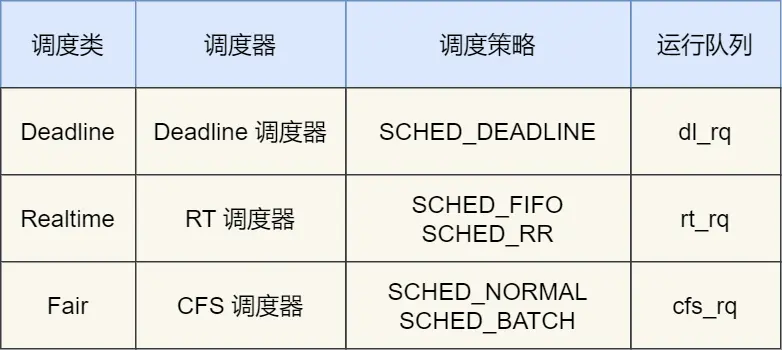
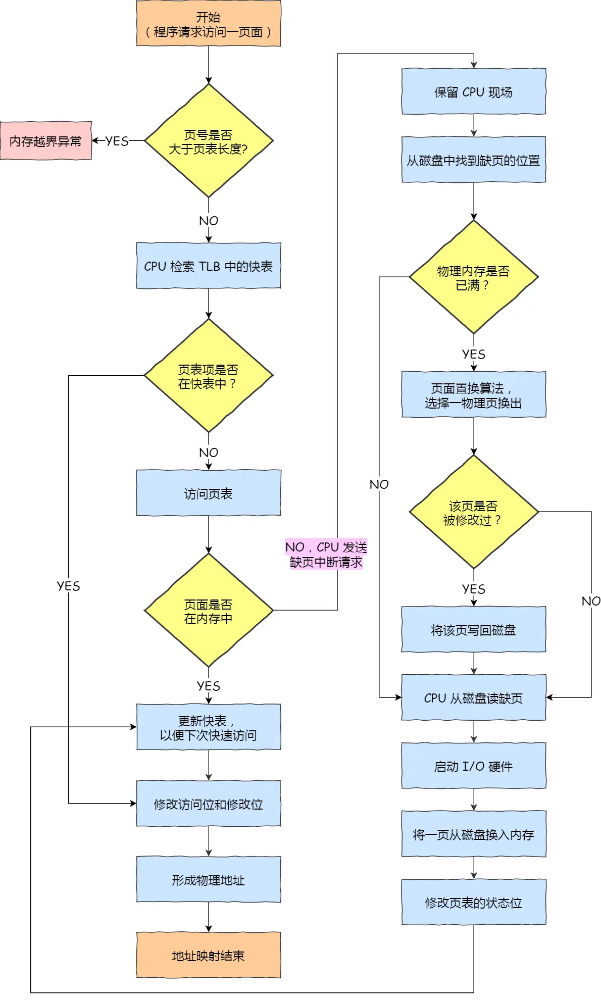
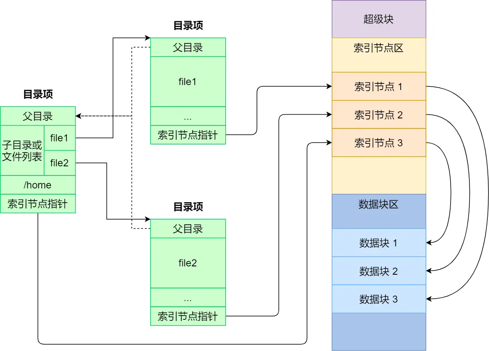
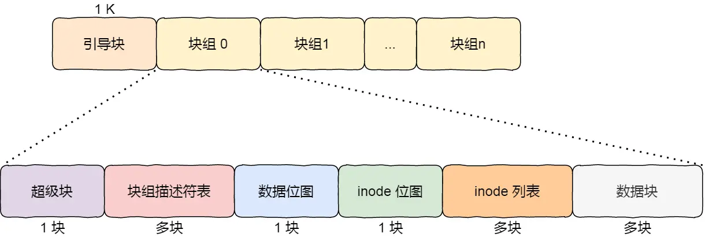

# 操作系统

## 目录

## 硬件结构

### CPU与程序执行

[CPU 是如何执行程序的？](https://xiaolincoding.com/os/1_hardware/how_cpu_run.html)

#### 图灵机的工作方式

#### 冯诺依曼模型

> 运算器 控制器 存储器 输入设备 输出设备

- 内存
- 中央处理器

> 中央处理器也就是我们常说的 CPU，32 位和 64 位 CPU 最主要区别在于一次能计算多少字节数据：
>
> - 32 位 CPU 一次可以计算 4 个字节；
> - 64 位 CPU 一次可以计算 8 个字节；
>
> 这里的 32 位和 64 位，通常称为 **CPU 的位宽**，代表的是 CPU 一次可以计算（运算）的数据量。
>
> - 控制单元
> - 逻辑运算单元
> - 寄存器
>   - 通用寄存器，用来存放需要进行运算的数据，比如需要进行加和运算的两个数据。
>   - 程序计数器，用来存储 CPU 要执行下一条指令「所在的内存地址」，注意不是存储了下一条要执行的指令，此时指令还在内存中，程序计数器只是存储了下一条指令「的地址」。
>   - 指令寄存器，用来存放当前正在执行的指令，也就是指令本身，指令被执行完成之前，指令都存储在这里。

- 总线

> 总线是用于 CPU 和内存以及其他设备之间的通信，总线可分为 3 种：
>
> - 地址总线，用于指定 CPU 将要操作的内存地址；
> - 数据总线，用于读写内存的数据；
> - 控制总线，用于发送和接收信号，比如中断、设备复位等信号，CPU 收到信号后自然进行响应，这时也需要控制总线；
>
> 当 CPU 要读写内存数据的时候，一般需要通过下面这三个总线：
>
> - 首先要通过「地址总线」来指定内存的地址；
> - 然后通过「控制总线」控制是读或写命令；
> - 最后通过「数据总线」来传输数据；

#### 线路位宽与CPU位宽

>CPU 想要操作「内存地址」就需要「地址总线」：32条就是2^32=4G内存。这里32就是线路位宽。
>
>因此CPU位宽如果大于等于线路位宽，就可以直接操作，否则需要多次计算。

#### 程序执行的基本过程

- 指令

> 一个指令周期：
>
> 1. CPU 通过程序计数器读取对应内存地址的指令，这个部分称为 **Fetch（取得指令）**；
> 2. CPU 对指令进行解码，这个部分称为 **Decode（指令译码）**；
> 3. CPU 执行指令，这个部分称为 **Execution（执行指令）**；
> 4. CPU 将计算结果存回寄存器或者将寄存器的值存入内存，这个部分称为 **Store（数据回写）**；

- 指令类型
- 指令的执行速度

#### 64位CPU和32位CPU？

> 指的是CPU的位宽。
>
> - 计算性能：一次计算不同位数
> - 内存访问：寻址不同大小物理内存空间（通常来说 64 位 CPU 的地址总线是 48 位，而 32 位 CPU 的地址总线是 32 位）

#### 64位软件和32位软件？

> 指的是指令的位宽。
>
> - 内存访问：寻址内存空间
> - 指令集：分别是64位指令集和32位指令集，64位指令集可以兼容32位。

### 存储器

[磁盘比内存慢几万倍？](https://xiaolincoding.com/os/1_hardware/storage.html)

#### 存储器的层次结构

- 寄存器
- CPU Cache
  - L1-Cache：数据缓存和指令缓存
  - L2-Cache
  - L3-Cache：多个CPU核心共享

- 内存
- SSD/HDD硬盘

#### 存储器的层次关系

>  每个存储器只和相邻的一层存储器设备打交道，并且存储设备为了追求更快的速度，所需的材料成本必然也是更高，也正因为成本太高，所以 CPU 内部的寄存器、L1\L2\L3 Cache 只好用较小的容量，相反内存、硬盘则可用更大的容量。

### 如何写出让CPU跑得更快的代码？

[如何写出让CPU跑得更快的代码？](https://xiaolincoding.com/os/1_hardware/how_to_make_cpu_run_faster.html)

> 要想写出让 CPU 跑得更快的代码，就需要写出缓存命中率高的代码，CPU L1 Cache 分为数据缓存和指令缓存，因而需要分别提高它们的缓存命中率：
>
> - 对于数据缓存，我们在遍历数据的时候，应该按照内存布局的顺序操作，这是因为 CPU Cache 是根据 CPU Cache Line 批量操作数据的，所以顺序地操作连续内存数据时，性能能得到有效的提升；
> - 对于指令缓存，有规律的条件分支语句能够让 CPU 的分支预测器发挥作用，进一步提高执行的效率；
>
> 另外，对于多核 CPU 系统，线程可能在不同 CPU 核心来回切换，这样各个核心的缓存命中率就会受到影响，于是要想提高线程的缓存命中率，可以考虑把线程绑定 CPU 到某一个 CPU 核心。

### CPU缓存一致性

[CPU缓存一致性](https://xiaolincoding.com/os/1_hardware/cpu_mesi.html)

- CPU Cache 的数据写入
  - 写直达
  - 写回

- 缓存一致性问题
  - 写传播（Write Propagation）
  - 事务的串行化（Transaction Serialization）

- 总线嗅探（Bus Snooping）

- MESI 协议
  - *Modified*，已修改
  - *Exclusive*，独占
  - *Shared*，共享
  - *Invalidated*，已失效

### CPU是如何执行任务的

[CPU是如何执行任务的](https://xiaolincoding.com/os/1_hardware/how_cpu_deal_task.html)

#### CPU如何读写数据的？

- 伪共享（False Sharing）：多个线程同时读写同一个 Cache Line 的不同变量时，而导致 CPU Cache 失效的现象
- 避免：避免在同一个Cache Line里，如内存对齐

#### CPU如何选择线程的？

- 调度类

> Deadline 和 Realtime 这两个调度类，都是应用于实时任务的，这两个调度类的调度策略合起来共有这三种，它们的作用如下：
>
> - *SCHED_DEADLINE*：是按照 deadline 进行调度的，距离当前时间点最近的 deadline 的任务会被优先调度；
> - *SCHED_FIFO*：对于相同优先级的任务，按先来先服务的原则，但是优先级更高的任务，可以抢占低优先级的任务，也就是优先级高的可以「插队」；
> - *SCHED_RR*：对于相同优先级的任务，轮流着运行，每个任务都有一定的时间片，当用完时间片的任务会被放到队列尾部，以保证相同优先级任务的公平性，但是高优先级的任务依然可以抢占低优先级的任务；
>
> 而 Fair 调度类是应用于普通任务，都是由 CFS 调度器管理的，分为两种调度策略：
>
> - *SCHED_NORMAL*：普通任务使用的调度策略；
> - *SCHED_BATCH*：后台任务的调度策略，不和终端进行交互，因此在不影响其他需要交互的任务，可以适当降低它的优先级。

- 完全公平调度：在 CFS 算法调度的时候，会优先选择 vruntime 少的任务（要考虑任务权重/nice值）

- CPU运行队列：dl_rq+rt_rq+cfs_rq。其中cfs_rq 是用红黑树来描述的，按 vruntime 大小来排序的
- 调整优先级：修改权值/nice值

### 什么是软中断？

[什么是软中断？](https://xiaolincoding.com/os/1_hardware/soft_interrupt.html)

- 什么是中断？
- 什么是软中断？

> 中断处理程序的上部分和下半部可以理解为：
>
> - **上半部直接处理硬件请求，也就是硬中断**，主要是负责耗时短的工作，特点是快速执行；
> - **下半部是由内核触发，也就说软中断**，主要是负责上半部未完成的工作，通常都是耗时比较长的事情，特点是延迟执行；
> - 硬中断（上半部）是会打断 CPU 正在执行的任务，然后立即执行中断处理程序，而软中断（下半部）是以内核线程的方式执行，并且每一个 CPU 都对应一个软中断内核线程，名字通常为「ksoftirqd/CPU 编号」，比如 0 号 CPU 对应的软中断内核线程的名字是 `ksoftirqd/0`。

### 为什么0.1+0.2不等于0.3？

[为什么0.1+0.2不等于0.3？](https://xiaolincoding.com/os/1_hardware/float.html)

- 为什么负数要用补码表示？

> 负数之所以用补码的方式来表示，主要是为了统一和正数的加减法操作一样，毕竟数字的加减法是很常用的一个操作，就不要搞特殊化，尽量以统一的方式来运算。

- 十进制小数怎么转成二进制？

> 十进制整数转二进制使用的是「除 2 取余法」，十进制小数使用的是「乘 2 取整法」。

- 计算机是怎么存小数的？

> 计算机是以浮点数的形式存储小数的，大多数计算机都是 IEEE 754 标准定义的浮点数格式，包含三个部分：
>
> - 符号位：表示数字是正数还是负数，为 0 表示正数，为 1 表示负数；
> - 指数位：指定了小数点在数据中的位置，指数可以是负数，也可以是正数，指数位的长度越长则数值的表达范围就越大；
> - 尾数位：小数点右侧的数字，也就是小数部分，比如二进制 1.0011 x 2^(-2)，尾数部分就是 0011，而且尾数的长度决定了这个数的精度，因此如果要表示精度更高的小数，则就要提高尾数位的长度；
>
> 用 32 位来表示的浮点数，则称为单精度浮点数，也就是我们编程语言中的 float 变量，而用 64 位来表示的浮点数，称为双精度浮点数，也就是 double 变量。

- 0.1 + 0.2 == 0.3 ？

> 不是的，0.1 和 0.2 这两个数字用二进制表达会是一个一直循环的二进制数，比如 0.1 的二进制表示为 0.0 0011 0011 0011… （0011 无限循环)，对于计算机而言，0.1 无法精确表达，这是浮点数计算造成精度损失的根源。
>
> 因此，IEEE 754 标准定义的浮点数只能根据精度舍入，然后用「近似值」来表示该二进制，那么意味着计算机存放的小数可能不是一个真实值。
>
> 0.1 + 0.2 并不等于完整的 0.3，这主要是因为这两个小数无法用「完整」的二进制来表示，只能根据精度舍入，所以计算机里只能采用近似数的方式来保存，那两个近似数相加，得到的必然也是一个近似数。

## 操作系统结构

### Linux 内核 vs Windows 内核（TODO）

[Linux 内核 vs Windows 内核](https://xiaolincoding.com/os/2_os_structure/linux_vs_windows.html)

## 内存管理

### 为什么要有虚拟内存？

[为什么要有虚拟内存？](https://xiaolincoding.com/os/3_memory/vmem.html)

#### 虚拟内存和物理内存

#### 内存分段

- 段选择因子和段内偏移量
- 不足？
  - 内存碎片（外部）
  - 内存交换的效率低

#### 内存分页

- 页号和偏移量
- 内存碎片（内部）
- 内存交换（代价较小）
- 缺陷？
  - 空间浪费：页不会很大，页表就会比较大
- 多级页表：
  - 全局页目录项 PGD（*Page Global Directory*）；
  - 上层页目录项 PUD（*Page Upper Directory*）；
  - 中间页目录项 PMD（*Page Middle Directory*）；
  - 页表项 PTE（*Page Table Entry*）；
  - 多层寻址，加大时间开销

- TLB（*Translation Lookaside Buffer*） ：存放程序最常访问的页表项的 Cache

#### 段页式内存管理

- 断号 + 段内页号 + 页内位移
- 段页式地址变换中要得到物理地址须经过三次内存访问：
  - 第一次访问段表，得到页表起始地址；
  - 第二次访问页表，得到物理页号；
  - 第三次将物理页号与页内位移组合，得到物理地址。

#### Linux 内存布局

- 虚拟内存的内存段：
  - 代码段，包括二进制可执行代码；
  - 数据段，包括已初始化的静态常量和全局变量；
  - BSS 段，包括未初始化的静态变量和全局变量；
  - 堆段，包括动态分配的内存，从低地址开始向上增长；
  - 文件映射段，包括动态库、共享内存等，从低地址开始向上增长（[跟硬件和内核版本有关](http://lishiwen4.github.io/linux/linux-process-memory-location)）；
  - 栈段，包括局部变量和函数调用的上下文等。栈的大小是固定的，一般是 `8 MB`。当然系统也提供了参数，以便我们自定义大小；
  - 保留段

### malloc是如何分配内存的？（TODO）

[malloc是如何分配内存的？](https://xiaolincoding.com/os/3_memory/malloc.html)

### 内存满了，会发生什么？（TODO）

### 在 4GB 物理内存的机器上，申请 8G 内存会怎么样？（TODO）

### 深入理解 Linux 虚拟内存管理（TODO）

[深入理解 Linux 虚拟内存管理](https://xiaolincoding.com/os/3_memory/linux_mem.html#_4-6-%E6%B7%B1%E5%85%A5%E7%90%86%E8%A7%A3-linux-%E8%99%9A%E6%8B%9F%E5%86%85%E5%AD%98%E7%AE%A1%E7%90%86)

### 深入理解 Linux 物理内存管理（TODO）

[深入理解 Linux 物理内存管理](https://xiaolincoding.com/os/3_memory/linux_mem2.html)

## 进程管理

### 进程&线程基础知识

#### 进程

- 进程：**运行中的程序，就被称为「进程」（Process），是资源分配的单位**
- 进程的状态
  - 运行状态（*Running*）：该时刻进程占用 CPU；
  - 就绪状态（*Ready*）：可运行，由于其他进程处于运行状态而暂时停止运行；
  - 阻塞状态（*Blocked*）：该进程正在等待某一事件发生（如等待输入/输出操作的完成）而暂时停止运行，这时，即使给它CPU控制权，它也无法运行；
  - 创建状态（*new*）：进程正在被创建时的状态；
  - 结束状态（*Exit*）：进程正在从系统中消失时的状态；
  - 阻塞挂起状态：进程在外存（硬盘）并等待某个事件的出现；
  - 就绪挂起状态：进程在外存（硬盘），但只要进入内存，即刻立刻运行；

- 进程的控制结构

  - **进程控制块**（*process control block，PCB*）：描述进程的数据结构

  - 通常是通过**链表**的方式进行组织，把具有**相同状态的进程链在一起，组成各种队列**。

- 进程的控制

- 进程的上下文切换
  - CPU上下文：CPU寄存器 +程序计数器 组成的环境

#### 线程

- 线程：**进程当中的一条执行流程，是独立运行的最小单位**
- 线程与进程的比较：
  - 进程是资源（包括内存、打开的文件等）分配的单位，线程是 CPU 调度的单位；
  - 进程拥有一个完整的资源平台，而线程只独享必不可少的资源，如寄存器和栈；
  - 线程同样具有就绪、阻塞、执行三种基本状态，同样具有状态之间的转换关系；
  - 线程能减少并发执行的时间和空间开销；
- 线程的上下文切换
  - 当两个线程不是属于同一个进程，则切换的过程就跟进程上下文切换一样；
  - **当两个线程是属于同一个进程，因为虚拟内存是共享的，所以在切换时，虚拟内存这些资源就保持不动，只需要切换线程的私有数据、寄存器等不共享的数据**；
- 线程的实现
  - **用户线程（User Thread）**：在用户空间实现的线程，不是由内核管理的线程，是由用户态的线程库来完成线程的管理；
    - 用户线程的整个线程管理和调度，操作系统是不直接参与的，而是由用户级线程库函数来完成线程的管理，包括线程的创建、终止、同步和调度等。
    - 用户级线程的模型，类似**多对一**的关系，即多个用户线程对应同一个内核线程
  - **内核线程（Kernel Thread）**：在内核中实现的线程，是由内核管理的线程；
    - 内核线程是由操作系统管理的，线程对应的 TCB 自然是放在操作系统里的，这样线程的创建、终止和管理都是由操作系统负责。
    - 内核线程的模型，类似**一对一**的关系，即一个用户线程对应一个内核线程
  - **轻量级进程（LightWeight Process）**：在内核中来支持用户线程；
    - 轻量级进程（\*Light-weight process，LWP\*）是内核支持的用户线程，一个进程可有一个或多个 LWP，每个 LWP 是跟内核线程一对一映射的，也就是 LWP 都是由一个内核线程支持，而且 LWP 是由内核管理并像普通进程一样被调度。
- 调度
  - 调度时机
  - 调度原则
    - **CPU 利用率**：调度程序应确保 CPU 是始终匆忙的状态，这可提高 CPU 的利用率；
    - **系统吞吐量**：吞吐量表示的是单位时间内 CPU 完成进程的数量，长作业的进程会占用较长的 CPU 资源，因此会降低吞吐量，相反，短作业的进程会提升系统吞吐量；
    - **周转时间**：周转时间是进程运行+阻塞时间+等待时间的总和，一个进程的周转时间越小越好；
    - **等待时间**：这个等待时间不是阻塞状态的时间，而是进程处于就绪队列的时间，等待的时间越长，用户越不满意；
    - **响应时间**：用户提交请求到系统第一次产生响应所花费的时间，在交互式系统中，响应时间是衡量调度算法好坏的主要标准。
  - 调度算法
    - 先来先服务（First Come First Serve, FCFS）
    - 最短作业优先（Shortest Job First, SJF）
    - 高响应比优先（Highest Response Ratio Next, HRRN）
    - 时间片轮转（Round Robin, RR）
    - 最高优先级（Highest Priority First，HPF）
    - 多级反馈队列（Multilevel Feedback Queue）

### 进程间的通信方式？

[进程间有哪些通信方式？](https://xiaolincoding.com/os/4_process/process_commu.html)

#### 管道

> - 命令：`|`（匿名管道）
>   - eg：`ps auxf | grep mysql`，前输出作为后输入
> - 命令：`mkfifo`（有名管道，先进先出）
>   - eg：`mkfifo myPipe`，创建命名管道（类型为管道的设备文件）
> - 所谓的管道，就是内核里面的一串缓存
>   - 对于匿名管道，它的通信范围是存在父子关系的进程
>   - 对于命名管道，它可以在不相关的进程间也能相互通信
> - 内容：无格式的字节流数据
> - 生命周期：跟随进程
> - 缺陷：单向

#### 消息队列

> - 消息队列是保存在内核中的消息链表
> - 内容：一个一个独立的数据单元（消息体/数据块）
> - 生命周期：跟随内核
> - 缺陷：每次数据的写入和读取都需要经过用户态与内核态之间的拷贝过程

#### 共享内存

> - 共享内存的机制，就是拿出一块虚拟地址空间来，映射到相同的物理内存中
> - 为什么：因为每个进程有虚拟内存，把某块虚拟内存映射到相同物理内存，那他们就是共享的
> - 缺陷：竞争

#### 信号量

> - 信号量其实是一个整型的计数器，主要用于实现进程间的互斥与同步，而不是用于缓存进程间通信的数据
> - 信号量表示资源的数量，控制信号量的方式有两种原子操作：
>   - 一个是 **P 操作**，这个操作会把信号量减去 1，相减后如果信号量 < 0，则表明资源已被占用，进程需阻塞等待；相减后如果信号量 >= 0，则表明还有资源可使用，进程可正常继续执行。
>   - 另一个是 **V 操作**，这个操作会把信号量加上 1，相加后如果信号量 <= 0，则表明当前有阻塞中的进程，于是会将该进程唤醒运行；相加后如果信号量 > 0，则表明当前没有阻塞中的进程；
>   - P 操作是用在进入共享资源之前，V 操作是用在离开共享资源之后，这两个操作是必须成对出现的。
> - 互斥信号量：`1`，保证共享内存在任何时刻只有一个进程在访问
> - 同步信号量：`0`，保证进程 A 应在进程 B 之前执行

#### 信号

> - 信号是进程间通信机制中**唯一的异步通信机制**
> - 处理：
>   - **1.执行默认操作**。Linux 对每种信号都规定了默认操作，例如，上面列表中的 SIGTERM 信号，就是终止进程的意思。
>   - **2.捕捉信号**。我们可以为信号定义一个信号处理函数。当信号发生时，我们就执行相应的信号处理函数。
>   - **3.忽略信号**。当我们不希望处理某些信号的时候，就可以忽略该信号，不做任何处理。有两个信号是应用进程无法捕捉和忽略的，即 `SIGKILL` 和 `SEGSTOP`，它们用于在任何时候中断或结束某一进程。

#### Socket

> - 系统调用：`int socket(int domain, int type, int protocal)`
>
>   - `domain` 参数用来指定协议族，比如 AF_INET 用于 IPV4、AF_INET6 用于 IPV6、AF_LOCAL/AF_UNIX 用于本机；
>
>   - `type` 参数用来指定通信特性，比如 SOCK_STREAM 表示的是字节流，对应 TCP、SOCK_DGRAM 表示的是数据报，对应 UDP、SOCK_RAW 表示的是原始套接字；
>
>   - `protocal` 参数原本是用来指定通信协议的，但现在基本废弃。因为协议已经通过前面两个参数指定完成，protocol 目前一般写成 0 即可；
>
>   - ----
>
>   - 实现 TCP 字节流通信： socket 类型是 AF_INET 和 SOCK_STREAM；
>
>   - 实现 UDP 数据报通信：socket 类型是 AF_INET 和 SOCK_DGRAM；
>
>   - 实现本地进程间通信： 「本地字节流 socket 」类型是 AF_LOCAL 和 SOCK_STREAM，「本地数据报 socket 」类型是 AF_LOCAL 和 SOCK_DGRAM。另外，AF_UNIX 和 AF_LOCAL 是等价的，所以 AF_UNIX 也属于本地 socket；
>
> - 针对 TCP 协议通信的 socket 编程模型
>
>   
>
> - 针对 UDP 协议通信的 socket 编程模型
>
>   
>
> - 针对本地进程间通信的 socket 编程模型
>
>   - 本地字节流 socket 和 本地数据报 socket 在 bind 的时候，不像 TCP 和 UDP 要绑定 IP 地址和端口，而是**绑定一个本地文件**

### 多线程冲突？

- 竞争与协作
  - 互斥
  - 同步
- 互斥与同步的实现与使用
  - 锁
    - 忙等待锁/自旋锁（spin lock）
    - 无等待锁
  - 信号量
    - 互斥信号量：`1`
    - 同步信号量：`0`
  - 生产者-消费者问题
- 经典同步问题
  - 哲学家就餐问题
    - 叉子信号量：死锁
    - 操作信号量：效率低（只能一个）
    - 奇偶分开
    - 分状态
  - 读者-写者问题
    - 读者优先
    - 写者优先
    - 公平

### 死锁？

> - 死锁概念
>   - 互斥条件
>   - 持有并等待条件
>   - 不可剥夺条件
>   - 环路等待条件
> - 死锁排查
> - 死锁避免

### 锁

> - 互斥锁与自旋锁
>   - **互斥锁**加锁失败后，线程会**释放 CPU** ，给其他线程；
>   - **自旋锁**加锁失败后，线程会**忙等待**，直到它拿到锁；
> - 读写锁
>   - 读优先锁，写优先锁，公平读写锁
>   - 公平读写锁比较简单的一种方式是：用队列把获取锁的线程排队，不管是写线程还是读线程都按照先进先出的原则加锁即可，这样读线程仍然可以并发，也不会出现「饥饿」的现象。 
> - 乐观锁和悲观锁
>   - 悲观锁：认为多线程同时修改共享资源的概率比较高，于是很容易出现冲突，所以访问共享资源前，先要上锁。
>   - 乐观锁：先修改完共享资源，再验证这段时间内有没有发生冲突，如果没有其他线程在修改资源，那么操作完成，如果发现有其他线程已经修改过这个资源，就放弃本次操作。

### 一个进程最多可以创建多少个线程？

[一个进程最多可以创建多少个线程？](https://xiaolincoding.com/os/4_process/create_thread_max.html)

> 这个问题跟两个东西有关系：
>
> - **进程的虚拟内存空间上限**，因为创建一个线程，操作系统需要为其分配一个栈空间，如果线程数量越多，所需的栈空间就要越大，那么虚拟内存就会占用的越多。
> - **系统参数限制**，虽然 Linux 并没有内核参数来控制单个进程创建的最大线程个数，但是有系统级别的参数来控制整个系统的最大线程个数。
>
> 比如：
>
> - 32 位系统，用户态的虚拟空间只有 3G，如果创建线程时分配的栈空间是 10M，那么一个进程最多只能创建 300 个左右的线程。
> - 64 位系统，用户态的虚拟空间大到有 128T，理论上不会受虚拟内存大小的限制，而会受系统的参数或性能限制。

### 线程崩溃了，进程也会崩溃吗？

[线程崩溃了，进程也会崩溃吗？](https://xiaolincoding.com/os/4_process/thread_crash.html)

## 调度算法

[调度算法](https://xiaolincoding.com/os/5_schedule/schedule.html)

### 进程调度算法（CPU调度算法）

- 先来先服务调度算法
- 最短作业优先调度算法
- 高响应比优先调度算法
- 时间片轮转调度算法
- 最高优先级调度算法
- 多级反馈队列调度算法
  - 「多级」表示有多个队列，每个队列优先级从高到低，同时优先级越高时间片越短。
  - 「反馈」表示如果有新的进程加入优先级高的队列时，立刻停止当前正在运行的进程，转而去运行优先级高的队列；

### 内存页面置换算法

面置换算法的功能是，**当出现缺页异常，需调入新页面而内存已满时，选择被置换的物理页面**。

- 最佳页面置换算法（*OPT*）
  - 置换在「未来」最长时间不访问的页面
  - 理想，可以用来衡量效率

- 先进先出置换算法（*FIFO*）
  - 选择在内存驻留时间很长的页面进行中置换

- 最近最久未使用的置换算法（*LRU*）
  - 选择最长时间没有被访问的页面进行置换
  - 需要根据使用时间维护顺序，代价高

- 时钟页面置换算法（*Lock*）
  - 把所有的页面都保存在一个类似钟面的「环形链表」中，一个表针指向最老的页面。
  - 当发生缺页中断时，算法首先检查表针指向的页面：
    - 如果它的访问位位是 0 就淘汰该页面，并把新的页面插入这个位置，然后把表针前移一个位置；
    - 如果访问位是 1 就清除访问位，并把表针前移一个位置，重复这个过程直到找到了一个访问位为 0 的页面为止；

- 最不常用置换算法（*LFU*）
  - 当发生缺页中断时，选择「访问次数」最少的那个页面，并将其淘汰

### 磁盘调度算法

- 先来先服务算法
- 最短寻道时间优先算法
  - 可能存在饥饿
- 扫描算法/电梯算法
  - 磁头在一个方向上移动，访问所有未完成的请求，直到磁头到达该方向上的最后的磁道，才调换方向
- 循环扫描算法
  - 可以看成模数扫描
- LOOK 与 C-LOOK 算法
  - 优化扫描：磁头移动到「最远的请求」位置而不是磁盘「最始端或最末端」
  - 优化扫描算法：LOOK
  - 优化循环扫描算法：C-LOOK

## 文件系统

### 文件系统全家桶

[文件系统全家桶](https://xiaolincoding.com/os/6_file_system/file_system.html)

#### 文件系统的基本组成

> Linux 最经典的一句话是：「**一切皆文件**」，不仅普通的文件和目录，就连块设备、管道、socket 等，也都是统一交给文件系统管理的。
>
> Linux 文件系统会为每个文件分配两个数据结构：**索引节点（index node）和目录项（directory entry）**，它们主要用来记录文件的元信息和目录层次结构。
>
> - 索引节点，也就是 *inode*，用来记录文件的元信息，比如 inode 编号、文件大小、访问权限、创建时间、修改时间、**数据在磁盘的位置**等等。索引节点是文件的**唯一**标识，它们之间一一对应，也同样都会被存储在硬盘中，所以**索引节点同样占用磁盘空间**。
> - 目录项，也就是 *dentry*，用来记录文件的名字、**索引节点指针**以及与其他目录项的层级关联关系。多个目录项关联起来，就会形成目录结构，但它与索引节点不同的是，**目录项是由内核维护的一个数据结构，不存放于磁盘，而是缓存在内存**。

#### 虚拟文件系统

> 文件系统的种类众多，而操作系统希望**对用户提供一个统一的接口**，于是在用户层与文件系统层引入了中间层，这个中间层就称为**虚拟文件系统（\*Virtual File System，VFS\*）。**
>
> Linux 支持的文件系统也不少，根据存储位置的不同，可以把文件系统分为三类：
>
> - *磁盘的文件系统*，它是直接把数据存储在磁盘中，比如 Ext 2/3/4、XFS 等都是这类文件系统。
> - *内存的文件系统*，这类文件系统的数据不是存储在硬盘的，而是占用内存空间，我们经常用到的 `/proc` 和 `/sys` 文件系统都属于这一类，读写这类文件，实际上是读写内核中相关的数据。
> - *网络的文件系统*，用来访问其他计算机主机数据的文件系统，比如 NFS、SMB 等等。
>
> 文件系统首先要先挂载到某个目录才可以正常使用，比如 Linux 系统在启动时，会把文件系统挂载到根目录。

#### 文件的使用

> 操作系统为每个进程维护一个打开文件表，文件表里的每一项代表「**文件描述符**」，所以说文件描述符是打开文件的标识。
>
> 用户和操作系统对文件的读写操作是有差异的，用户习惯以字节的方式读写文件，而操作系统则是以数据块来读写文件，那屏蔽掉这种差异的工作就是文件系统了。
>
> 我们来分别看一下，读文件和写文件的过程：
>
> - 当用户进程从文件读取 1 个字节大小的数据时，文件系统则需要获取字节所在的数据块，再返回数据块对应的用户进程所需的数据部分。
> - 当用户进程把 1 个字节大小的数据写进文件时，文件系统则找到需要写入数据的数据块的位置，然后修改数据块中对应的部分，最后再把数据块写回磁盘。
>
> 所以说，**文件系统的基本操作单位是数据块**。

#### 文件的存储

- 连续空间存放方式
  - 磁盘空间碎片
  - 文件长度不易拓展
- 非连续空间方式
  - 链表
    - 隐式链表：访问要轮训，稳定性差
    - 显示链表：指针拿出来，维护链接表，即文件分配表（File Allocation Table，FAT），但太大会耗内存
  - 索引
    - 索引数据块：存放指向文件数据块的指针列表，类似目录
  - 组合
    - 链式索引块：在索引数据块留出一个存放下一个索引数据块的指针
    - 多级索引块：通过一个索引块来存放多个索引数据块
- Unix文件的实现方式

#### 空闲空间管理

- 空闲表法
- 空闲链表法
- 位图法

#### 文件系统的结构

> 位图方式分块组。
>
> - *超级块*，包含的是文件系统的重要信息，比如 inode 总个数、块总个数、每个块组的 inode 个数、每个块组的块个数等等。
> - *块组描述符*，包含文件系统中各个块组的状态，比如块组中空闲块和 inode 的数目等，每个块组都包含了文件系统中「所有块组的组描述符信息」。
> - *数据位图和 inode 位图*， 用于表示对应的数据块或 inode 是空闲的，还是被使用中。
> - *inode 列表*，包含了块组中所有的 inode，inode 用于保存文件系统中与各个文件和目录相关的所有元数据。
> - *数据块*，包含文件的有用数据。

#### 目录的存储

> 普通文件的块里面保存的是文件数据，而目录文件的块里面保存的是目录里面一项一项的文件信息

#### 软链接和硬链接

> - 硬链接：硬链接是**多个目录项中的「索引节点」指向一个文件**，也就是指向同一个 inode，但是 inode 是不可能跨越文件系统的，每个文件系统都有各自的 inode 数据结构和列表，所以**硬链接是不可用于跨文件系统的**。由于多个目录项都是指向一个 inode，那么**只有删除文件的所有硬链接以及源文件时，系统才会彻底删除该文件。**
> - 软链接：软链接相当于重新创建一个文件，这个文件有**独立的 inode**，但是这个**文件的内容是另外一个文件的路径**，所以访问软链接的时候，实际上相当于访问到了另外一个文件，所以**软链接是可以跨文件系统的**，甚至**目标文件被删除了，链接文件还是在的，只不过指向的文件找不到了而已。**

#### 文件IO

- 缓冲与非缓冲 I/O
  - 缓冲 I/O，利用的是标准库的缓存实现文件的加速访问，而标准库再通过系统调用访问文件。
  - 非缓冲 I/O，直接通过系统调用访问文件，不经过标准库缓存。
- 直接与非直接 I/O
  - 直接 I/O，不会发生内核缓存和用户程序之间数据复制，而是直接经过文件系统访问磁盘。
  - 非直接 I/O，读操作时，数据从内核缓存中拷贝给用户程序，写操作时，数据从用户程序拷贝给内核缓存，再由内核决定什么时候写入数据到磁盘。
  - 以下几种场景会触发内核缓存的数据写入磁盘：
    - 在调用 `write` 的最后，当发现内核缓存的数据太多的时候，内核会把数据写到磁盘上；
    - 用户主动调用 `sync`，内核缓存会刷到磁盘上；
    - 当内存十分紧张，无法再分配页面时，也会把内核缓存的数据刷到磁盘上；
    - 内核缓存的数据的缓存时间超过某个时间时，也会把数据刷到磁盘上；
- 阻塞与非阻塞 I/O VS 同步与异步 I/O

### 进程写文件时，进程发生了崩溃，已写入的数据会丢失吗？（TODO）

[进程写文件时，进程发生了崩溃，已写入的数据会丢失吗？](https://xiaolincoding.com/os/6_file_system/pagecache.html)

## 设备管理

### 键盘敲入 A 字母时，操作系统期间发生了什么？

[键盘敲入 A 字母时，操作系统期间发生了什么？](https://xiaolincoding.com/os/7_device/device.html)

- **设备控制器（Device Control）**：每个设备都有个设备控制器，CPU 是通过设备控制器来和设备打交道的。

  - 设备控制器有芯片，寄存器。
    - **数据寄存器**，CPU 向 I/O 设备写入需要传输的数据，比如要打印的内容是「Hello」，CPU 就要先发送一个 H 字符给到对应的 I/O 设备。
    - **命令寄存器**，CPU 发送一个命令，告诉 I/O 设备，要进行输入/输出操作，于是就会交给 I/O 设备去工作，任务完成后，会把状态寄存器里面的状态标记为完成。
    - **状态寄存器**，目的是告诉 CPU ，现在已经在工作或工作已经完成，如果已经在工作状态，CPU 再发送数据或者命令过来，都是没有用的，直到前面的工作已经完成，状态寄存标记成已完成，CPU 才能发送下一个字符和命令。
  - 输入输出设备可分为两大类 ：**块设备（Block Device）**和**字符设备（Character Device）**。
    - 块设备，把数据存储在固定大小的块中，每个块有自己的地址，硬盘、USB 是常见的块设备。
    - 字符设备，以字符为单位发送或接收一个字符流，字符设备是不可寻址的，也没有任何寻道操作，鼠标是常见的字符设备。
  -  CPU 是如何与设备的控制寄存器和数据缓冲区进行通信的？存在两个方法：
    - *端口 I/O*，每个控制寄存器被分配一个 I/O 端口，可以通过特殊的汇编指令操作这些寄存器，比如 `in/out` 类似的指令。
    - *内存映射 I/O*，将所有控制寄存器映射到内存空间中，这样就可以像读写内存一样读写数据缓冲区。

- I/O 控制方式：设备如何通知CPU？

  - 轮训等待：占用CPU，不好
  - 中断：（中断控制器）CPU经常被打断
    - 软中断：例如代码调用 `INT` 指令触发
    - 硬中断：硬件通过中断控制器触发
  - DMA（Direct Memory Access）
    - CPU 需对 DMA 控制器下发指令，告诉它想读取多少数据，读完的数据放在内存的某个地方就可以了；
    - 接下来，DMA 控制器会向磁盘控制器发出指令，通知它从磁盘读数据到其内部的缓冲区中，接着磁盘控制器将缓冲区的数据传输到内存；
    - 当磁盘控制器把数据传输到内存的操作完成后，磁盘控制器在总线上发出一个确认成功的信号到 DMA 控制器；
    - DMA 控制器收到信号后，DMA 控制器发中断通知 CPU 指令完成，CPU 就可以直接用内存里面现成的数据了；

- **设备驱动程序**：屏蔽「设备控制器」的差异

  - 设备控制器不属于操作系统范畴，它是属于硬件，而设备驱动程序属于操作系统的一部分
  - 不同的设备控制器虽然功能不同，但是**设备驱动程序会提供统一的接口给操作系统**

- 通用块层

  - 通用块层是处于文件系统和磁盘驱动中间的一个块设备抽象层，它主要有两个功能：
    - 第一个功能，向上为文件系统和应用程序，提供访问块设备的标准接口，向下把各种不同的磁盘设备抽象为统一的块设备，并在内核层面，提供一个框架来管理这些设备的驱动程序；
    - 第二功能，通用层还会给文件系统和应用程序发来的 I/O 请求排队，接着会对队列重新排序、请求合并等方式，也就是 I/O 调度，主要目的是为了提高磁盘读写的效率。

- 存储设备I/O软件分层

  - 文件系统层，包括虚拟文件系统和其他文件系统的具体实现，它向上为应用程序统一提供了标准的文件访问接口，向下会通过通用块层来存储和管理磁盘数据。
  - 通用块层，包括块设备的 I/O 队列和 I/O 调度器，它会对文件系统的 I/O 请求进行排队，再通过 I/O 调度器，选择一个 I/O 发给下一层的设备层。
  - 设备层，包括硬件设备、设备控制器和驱动程序，负责最终物理设备的 I/O 操作。

  

- 键盘敲入字母时，发生了什么？

## 网络系统

### 什么是零拷贝？（TODO）

[什么是零拷贝？](https://xiaolincoding.com/os/8_network_system/zero_copy.html)

### I/O 多路复用：select/poll/epoll

[I/O 多路复用：select/poll/epoll](https://xiaolincoding.com/os/8_network_system/selete_poll_epoll.html)

#### 最基本的Socket模型

#### 如何服务更多的用户？

#### 多进程模型

#### 多线程模型

#### I/O 多路复用

- select/poll

  > select 实现多路复用的方式是，将已连接的 Socket 都放到一个**文件描述符集合**，然后调用 select 函数将文件描述符集合**拷贝**到内核里，让内核来检查是否有网络事件产生，检查的方式很粗暴，就是通过**遍历**文件描述符集合的方式，当检查到有事件产生后，将此 Socket 标记为可读或可写， 接着再把整个文件描述符集合**拷贝**回用户态里，然后用户态还需要再通过**遍历**的方法找到可读或可写的 Socket，然后再对其处理。
  >
  > 所以，对于 select 这种方式，需要进行 **2 次「遍历」文件描述符集合**，一次是在内核态里，一个次是在用户态里 ，而且还会发生 **2 次「拷贝」文件描述符集合**，先从用户空间传入内核空间，由内核修改后，再传出到用户空间中。
  >
  > select 使用固定长度的 BitsMap，表示文件描述符集合，而且所支持的文件描述符的个数是有限制的，在 Linux 系统中，由内核中的 FD_SETSIZE 限制， 默认最大值为 `1024`，只能监听 0~1023 的文件描述符。
  >
  > poll 不再用 BitsMap 来存储所关注的文件描述符，取而代之用动态数组，以链表形式来组织，突破了 select 的文件描述符个数限制，当然还会受到系统文件描述符限制。
  >
  > 但是 poll 和 select 并没有太大的本质区别，**都是使用「线性结构」存储进程关注的 Socket 集合，因此都需要遍历文件描述符集合来找到可读或可写的 Socket，时间复杂度为 O(n)，而且也需要在用户态与内核态之间拷贝文件描述符集合**，这种方式随着并发数上来，性能的损耗会呈指数级增长。

- epoll

  > epoll 通过两个方面，很好解决了 select/poll 的问题。
  >
  > *第一点*，epoll 在内核里使用**红黑树来跟踪进程所有待检测的文件描述字**，把需要监控的 socket 通过 `epoll_ctl()` 函数加入内核中的红黑树里，红黑树是个高效的数据结构，增删改一般时间复杂度是 `O(logn)`。而 select/poll 内核里没有类似 epoll 红黑树这种保存所有待检测的 socket 的数据结构，所以 select/poll 每次操作时都传入整个 socket 集合给内核，而 epoll 因为在内核维护了红黑树，可以保存所有待检测的 socket ，所以只需要传入一个待检测的 socket，减少了内核和用户空间大量的数据拷贝和内存分配。
  >
  > *第二点*， epoll 使用**事件驱动**的机制，内核里**维护了一个链表来记录就绪事件**，当某个 socket 有事件发生时，通过**回调函数**内核会将其加入到这个就绪事件列表中，当用户调用 `epoll_wait()` 函数时，只会返回有事件发生的文件描述符的个数，不需要像 select/poll 那样轮询扫描整个 socket 集合，大大提高了检测的效率。

- epoll两种事件触发模式：边缘触发（ET）和水平触发（LT）

  - 使用边缘触发模式时，当被监控的 Socket 描述符上有可读事件发生时，**服务器端只会从 epoll_wait 中苏醒一次**，即使进程没有调用 read 函数从内核读取数据，也依然只苏醒一次，因此我们程序要保证一次性将内核缓冲区的数据读取完；
  - 使用水平触发模式时，当被监控的 Socket 上有可读事件发生时，**服务器端不断地从 epoll_wait 中苏醒，直到内核缓冲区数据被 read 函数读完才结束**，目的是告诉我们有数据需要读取；

### 高性能网络模式：Reactor 和 Proactor

[高性能网络模式：Reactor 和 Proactor](https://xiaolincoding.com/os/8_network_system/reactor.html)

### 什么是一致性哈希？（服务器多节点的负载均衡问题）

[什么是一致性哈希？](https://xiaolincoding.com/os/8_network_system/hash.html)

- 如何分配请求？（负载均衡问题）
  - 引入负载均衡层
  - 引入加权轮询算法
  - 需要能应对分布式系统的负载均衡算法
- 使用哈希算法有什么问题？
  - 哈希模运算的模（服务器节点数量）变化，迁移很麻烦
- 使用一致性哈希算法有什么问题？
  - **一致性哈希是指将「存储节点」和「数据」都映射到一个首尾相连的哈希环上**
  - 对「数据」进行哈希映射，映射的结果值往**顺时针的方向的找到第一个节点**，就是存储该数据的节点。
  - **在一致哈希算法中，如果增加或者移除一个节点，仅影响该节点在哈希环上顺时针相邻的后继节点，其它数据也不会受到影响**
  - 缺陷：**一致性哈希算法并不保证节点能够在哈希环上分布均匀**
  - 所以，**一致性哈希算法虽然减少了数据迁移量，但是存在节点分布不均匀的问题**。
- 如何通过虚拟节点提高均衡度？
  - **不再将真实节点映射到哈希环上，而是将虚拟节点映射到哈希环上，并将虚拟节点映射到实际节点，所以这里有「两层」映射关系**
  - 另外，虚拟节点除了会提高节点的均衡度，还会提高系统的稳定性。**当节点变化时，会有不同的节点共同分担系统的变化，因此稳定性更高**。
  - 有了虚拟节点后，还可以为硬件配置更好的节点增加权重，比如对权重更高的节点增加更多的虚拟机节点即可。
  - 因此，**带虚拟节点的一致性哈希方法不仅适合硬件配置不同的节点的场景，而且适合节点规模会发生变化的场景**。

## Linux命令

### 如何查看网络的性能指标

[如何查看网络的性能指标](https://xiaolincoding.com/os/9_linux_cmd/linux_network.html)

#### 性能指标有哪些？

> - *带宽*，表示链路的最大传输速率，单位是 b/s （比特 / 秒），带宽越大，其传输能力就越强。
> - *延时*，表示请求数据包发送后，收到对端响应，所需要的时间延迟。不同的场景有着不同的含义，比如可以表示建立 TCP 连接所需的时间延迟，或一个数据包往返所需的时间延迟。
> - *吞吐率*，表示单位时间内成功传输的数据量，单位是 b/s（比特 / 秒）或者 B/s（字节 / 秒），吞吐受带宽限制，带宽越大，吞吐率的上限才可能越高。
> - *PPS*，全称是 Packet Per Second（包 / 秒），表示以网络包为单位的传输速率，一般用来评估系统对于网络的转发能力。
>
> 其它：
>
> - *网络的可用性*，表示网络能否正常通信；
> - *并发连接数*，表示 TCP 连接数量；
> - *丢包率*，表示所丢失数据包数量占所发送数据组的比率；
> - *重传率*，表示重传网络包的比例；

#### 网络配置如何看？

> - config
> - ip（推荐）

#### socket 信息如何查看？

> - netstat
> - ss（推荐）

#### 网络吞吐率和PPS如何查看？

> 可以使用 `sar` 命令当前网络的吞吐率和 PPS，用法是给 `sar` 增加 `-n` 参数就可以查看网络的统计信息，比如
>
> - sar -n DEV，显示网口的统计数据；
> - sar -n EDEV，显示关于网络错误的统计数据；
> - sar -n TCP，显示 TCP 的统计数据

#### 连通性和延时如何查看？

> 要测试本机与远程主机的连通性和延时，通常是使用 `ping` 命令，它是基于 ICMP 协议的，工作在网络层。
>
> 需要注意的是，`ping` 不通服务器并不代表 HTTP 请求也不通，因为有的服务器的防火墙是会禁用 ICMP 协议的。

### 如何从日志分析PV，UV？（TODO）

[如何从日志分析PV，UV？](https://xiaolincoding.com/os/9_linux_cmd/pv_uv.html)
