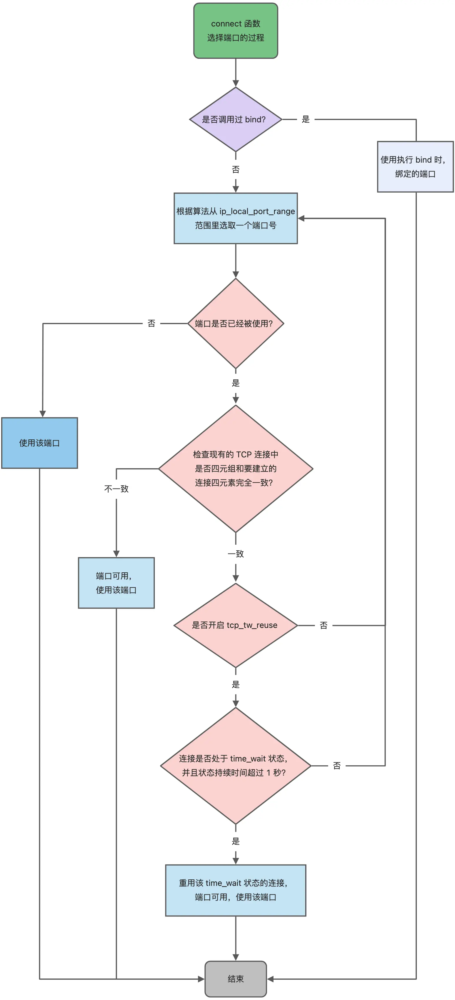

<!--
 * @Autor: violet apricity ( Zhuangpx )
 * @Date: 2023-01-25 16:05:16
 * @LastEditors: violet apricity ( Zhuangpx )
 * @LastEditTime: 2023-05-12 20:24:34
 * @FilePath: \cpp_work_for_funf:\CS\Projects\Zhuangpx_CS\Basic\计算机网络\计算机网络.md
 * @Description:  Zhuangpx : Violet && Apricity:/ The warmth of the sun in the winter /
-->
# 计算机网络

## 目录

## 计网基础

- TCP/IP 网络模型

> - 应用层 - HTTP
> - 传输层 - TCP/UDP
> - 网络层 - IP
> - 数据链路层/网络接口层

[小林coding：TCP/IP 网络模型有哪几层？](https://xiaolincoding.com/network/1_base/tcp_ip_model.html)

- 键入网址到网页显示，期间发生了什么？

[小林coding：键入网址到网页显示，期间发生了什么？](https://xiaolincoding.com/network/1_base/what_happen_url.html)

> 1. 解析URL，生成HTTP请求报文
> 2. 解析域名，DNS服务器查目的IP
> 3. 三次握手建立TCP连接，报文加上TCP头部
> 4. 查路由表（多网卡确定源IP），报文加上IP头部
> 5. ARP协议，查MAC，报文加上MAC头部
> 6. 网卡：数字信息转电信号
> 7. 交换机转发：二级网络设备，基于以太网
> 8. 路由器转发：三级网络设备，基于IP
> 9. 数据包抵达，解析返回响应

## HTTP

### HTTP Basic

#### HTTP基本概念

- HTTP是什么

> HTTP 是超文本传输协议，也就是`HyperText Transfer Protocol`。
>
> HTTP = 超文本 + 传输 + 协议
>
> HTTP 是一个在计算机世界里专门在「两点」之间「传输」文字、图片、音频、视频等「超文本」数据的「约定和规范」。

[HTTP 是什么？](https://xiaolincoding.com/network/2_http/http_interview.html#http-%E6%98%AF%E4%BB%80%E4%B9%88)

- HTTP状态码？

> - 1xx 提示信息
> - 2xx 成功
> - 3xx 重定向
> - 4xx 客户端错误
> - 5xx 服务器错误

[HTTP 常见的状态码有哪些？](https://xiaolincoding.com/network/2_http/http_interview.html#http-%E5%B8%B8%E8%A7%81%E7%9A%84%E7%8A%B6%E6%80%81%E7%A0%81%E6%9C%89%E5%93%AA%E4%BA%9B)

- HTTP字段？

> Host：客户端发送请求时，用来指定服务器的域名。
>
> Content-Length：服务器在返回数据时，表明本次回应的数据长度。
>
> Connection：常用于客户端要求服务器使用「HTTP 长连接」机制，`Connection: Keep-Alive`。
>
> Content-Type：服务器回应时，告诉客户端，本次数据是什么格式。
>
> Accept：客户端请求的时候，声明自己可以接受哪些数据格式。
>
> Content-Encoding：说明数据的压缩方法。表示服务器返回的数据使用了什么压缩格式。
>
> Accept-Encoding：客户端在请求时，说明自己可以接受哪些压缩方法。

[HTTP 常见字段有哪些？](https://xiaolincoding.com/network/2_http/http_interview.html#http-%E5%B8%B8%E8%A7%81%E5%AD%97%E6%AE%B5%E6%9C%89%E5%93%AA%E4%BA%9B)

#### GET 与 POST

[GET 与 POST](https://xiaolincoding.com/network/2_http/http_interview.html#get-%E4%B8%8E-post)

#### HTTP缓存

> 强制缓存 - 客户端决定
>
> - `Cache-Control`，相对时间
> - `Expires`，绝对时间
>
> 协商缓存 - 服务器决定
>
> - `If-Modified-Since` + `Last-Modified`：基于时间
> - `If-None-Match` + `ETag`：基于标识

[HTTP 缓存技术](https://xiaolincoding.com/network/2_http/http_interview.html#http-%E7%BC%93%E5%AD%98%E6%8A%80%E6%9C%AF)

#### HTTP特性

- HTTP/1.1 的优点？

> 1. 简单
> 2. 灵活和易于扩展
> 3. 应用广泛和跨平台

- HTTP/1.1 的缺点？

> 1. 无状态（Cookie）
> 2. 明文传输
> 3. 不安全：不加密，不验证，不完整 -> 窃听，冒充，篡改

- HTTP/1.1 的性能？

> 1. 长连接：减少了 TCP 连接的重复建立和断开所造成的额外开销
> 2. 管道网络传输：一般不用，HTTP/1.1 管道解决了请求的队头阻塞，但是没有解决响应的队头阻塞
> 3. 队头阻塞：性能瓶颈

#### HTTP与HTTPS

- HTTP和HTTPS的区别？

> 1. HTTPS = HTTP 网络层和TCP之间加入SSL/TLS 安全协议
> 2. SSL/TLS也要进行握手（1.2四次，1.3三次）
> 3. HTTP默认端口80，HTTPS默认端口443
> 4. HTTPS 协议需要向 CA（证书权威机构）申请数字证书，来保证服务器的身份可信

- HTTPS解决了HTTP哪些问题？

> 1. HTTP风险：窃听 + 篡改 + 冒充
> 2. HTTPS解决：信息加密 + 校验机制 + 身份证书
> 3. 如何解决？
>    1. 混合加密：对称加密 + 非对称加密
>    2. 摘要算法 + 数字签名：摘要算法生成哈希值，私钥加密哈希值生成数字签名
>    3. 数字证书：CA （数字证书认证机构）颁发数字证书 （信息+公钥+数字签名）

- HTTPS 是如何建立连接的？其间交互了什么？

> SSL/TLS 协议基本流程（先握手再通信）：
>
> - 客户端向服务器索要并验证服务器的公钥。
> - 双方协商生产「会话秘钥」。
> - 双方采用「会话秘钥」进行加密通信。

- HTTPS 的应用数据是如何保证完整性的？

> TLS 在实现上分为**握手协议**和**记录协议**两层：
>
> - TLS 握手协议就是 TLS 四次握手的过程，负责协商加密算法和生成对称密钥，后续用此密钥来保护应用程序数据（即 HTTP 数据）
> - TLS 记录协议负责保护应用程序数据并验证其完整性和来源，所以对 HTTP 数据加密是使用记录协议

#### HTTP/1.1，HTTP/2，HTTP/3 演变

- HTTP/1.0 -> HTTP/1.1

> 改进：
>
> - 长连接
> - 管道网络传输
>
> 性能瓶颈：
>
> - `header`无压缩，只压缩`Body`
> - 首部冗长
> - 队头阻塞（一般是不会用管道传输的，用了也只是解决请求的队头阻塞）
> - 没有请求优先控制
> - 请求只能客户端主动发起，服务器被动响应

- HTTP/1.1 -> 基于HTTPS和TCP的HTTP/2

> 改进：
>
> - 头部压缩：`HPACK` 算法。在客户端和服务器同时维护一张头信息表，所有字段都会存入这个表，生成一个索引号，以后就不发送同样字段了，只发送索引号
> - 二进制格式：头信息和数据体都是二进制，并且统称为帧（frame）：头信息帧（Headers Frame）和数据帧（Data Frame）
> - 并发传输：多Stream复用，针对不同的 HTTP 请求用独一无二的 Stream ID 来区分，接收端可以通过 Stream ID 有序组装成 HTTP 消息，不同 Stream 的帧是可以乱序发送的，因此可以并发不同的 Stream ，也就是 HTTP/2 可以并行交错地发送请求和响应
> - 服务器推送：客户端和服务器双方都可以建立 Stream，按Stream ID的奇（客户端建立）偶（服务器建立）区分
>
> 缺陷：
>
> - 队头阻塞：TCP层存在，丢包就得重传

- HTTP/2 -> 基于HTTPS和UDP（基于QUIC）的HTTP/3

> 把TCP改成了基于QUIC协议的UDP：
>
> - 无队头阻塞：多个Stream互相独立不依赖
> - 更快的连接建立：QUIC内部包含TLS，原TCP三次握手和TLS三次握手（1.2四次，1.3三次），现QUIC/UDP三次握手
> - 连接迁移：通过连接 ID 来标记通信的两个端点
> - QUIC 是一个在 UDP 之上的伪 TCP + TLS + HTTP/2 的多路复用的协议

### HTTP/1.1如何优化？

> 1. 尽量避免发送HTTP请求：缓存
> 2. 尽量减少HTTP请求次数
>    1. 减少重定向请求次数：代理服务器来做重定向的工作
>    2. 合并请求：合并资源
>    3. 延迟发送请求：比如下滑页面
> 3. 尽量减少HTTP响应大小
>    1. 无损压缩
>    2. 有损压缩

### HTTPS RSA 握手协议（TODO）

### HTTPS ECDHE 握手协议（TODO）

### HTTPS 如何优化？（TODO）

### HTTP/2 强在哪？

> - 兼容HTTP/1.1：
>   - HTTP/2 没有在 URI 里引入新的协议名
>   - 只在应用层做了改变，还是基于 TCP 协议传输，应用层分成语义（不变）和语法（变）
> - 头部（header）压缩，HPACK算法：
>   - 态字典：61种高频字符串
>   - 动态字典：同一个连接上，重复传输完全相同的 HTTP 头部
>   - Huffman编码（压缩算法）：编号压缩二进制
> - 二进制帧：将 HTTP/1 的文本格式改成二进制格式
> - 并发传输：Stream + Message + Frame
> - 服务器自动推送资源：Stream 分奇偶

### HTTP/3（TODO）

### 有了HTTP协议，为什么还要有RPC？

[既然有 HTTP 协议，为什么还要有 RPC？](https://xiaolincoding.com/network/2_http/http_rpc.html)

### 有了HTTP协议，为什么还要有WebSocket？

[既然有 HTTP 协议，为什么还要有 WebSocket？](https://xiaolincoding.com/network/2_http/http_websocket.html)

## TCP

### TCP Basic

#### TCP基本概念

[TCP基本认识](https://xiaolincoding.com/network/3_tcp/tcp_interview.html#tcp-%E5%9F%BA%E6%9C%AC%E8%AE%A4%E8%AF%86)

- TCP头格式

> - 序列号
> - 确认应答号
> - 控制位
>   - ACK：该位为 `1` 时，「确认应答」的字段变为有效，TCP 规定除了最初建立连接时的 `SYN` 包之外该位必须设置为 `1` 。
>   - RST：该位为 `1` 时，表示 TCP 连接中出现异常必须强制断开连接。
>   - SYN：该位为 `1` 时，表示希望建立连接，并在其「序列号」的字段进行序列号初始值的设定。
>   - FIN：该位为 `1` 时，表示今后不会再有数据发送，希望断开连接。当通信结束希望断开连接时，通信双方的主机之间就可以相互交换 `FIN` 位为 1 的 TCP 段。

- 为什么需要 TCP 协议？ TCP 工作在哪一层？

> - 因为 TCP 是一个工作在**传输层**的**可靠**数据传输的服务，它能确保接收端接收的网络包是**无损坏、无间隔、非冗余和按序的。**

- 什么是TCP？

> TCP 是**面向连接的、可靠的、基于字节流**的传输层通信协议。
>
> - 面向连接：一对一连接
> - 可靠：无论的网络链路中出现了怎样的链路变化，TCP 都可以保证一个报文一定能够到达接收端
> - 字节流：消息分组成有序的TCP报文

- 什么是TCP连接？

> 用于保证可靠性和流量控制维护的某些状态信息，这些信息的组合，包括 Socket、序列号和窗口大小称为连接。
>
> - Socket：IP地址+端口号
> - 序列号：解决乱序问题等
> - 窗口大小：流量控制

- 如何唯一确定一个TCP连接？单IP服务器最大TCP连接数？

> - 四元组：源地址 + 源端口 + 目的地址 + 目的端口
>
> - 最大TCP连接数 = 客户端IP数 * 客户端端口数
> - 影响：
>   - 文件描述符限制（系统级+用户级+进程级）
>   - 内存限制

- UDP和TCP的区别？

> 1. 连接
> 2. 服务对象
> 3. 可靠性
> 4. 拥塞控制，流量控制
> 5. 首部开销
> 6. 传输方式
> 7. 分片不同

- TCP和UDP的应用场景：

> TCP：
>
> - `FTP` 文件传输
> - HTTP / HTTPS
>
> UDP：
>
> - 包总量较少的通信，如 `DNS` 、`SNMP` 等
> - 视频、音频等多媒体通信
> - 广播通信

#### TCP连接建立

[TCP连接建立](https://xiaolincoding.com/network/3_tcp/tcp_interview.html#tcp-%E8%BF%9E%E6%8E%A5%E5%BB%BA%E7%AB%8B)

- TCP三次握手？
- 为什么是三次握手？

> 1. 三次握手才可以阻止重复历史连接的初始化（主要原因）
>    - 为什么两次不行？
>      - 在两次握手的情况下，服务端没有中间状态给客户端来阻止历史连接，导致服务端可能建立一个历史连接，造成资源浪费。
>    - 第三次握手的ack报文丢了，后面发送的数据是不是浪费了？
>      - 不是。因为数据报文中是有 ack 标识位，也有确认号，这个确认号就是确认收到了第二次握手。
> 2. 三次握手才可以同步双方的初始序列号
>    - 序列号作用：
>      - 接收方可以去除重复的数据；
>      - 接收方可以根据数据包的序列号按序接收；
>      - 可以标识发送出去的数据包中， 哪些是已经被对方收到的（通过 ACK 报文中的序列号知道）；
> 3. 三次握手才可以避免资源浪费
>    - 两次握手可能会重复建立连接
> 4. 不使用「两次握手」和「四次握手」的原因：
>    - 「两次握手」：无法防止历史连接的建立，会造成双方资源的浪费，也无法可靠的同步双方序列号；
>    - 「四次握手」：三次握手就已经理论上最少可靠连接建立，所以不需要使用更多的通信次数。

- 第一次握手丢失了，会发生什么？

> 超时重传，序列号一样。
>
> 最大重传次数由 `tcp_syn_retries`内核参数控制，每次间隔是上一次的两倍，超过后断开。

- 第二次握手丢失了，会发生什么？

> 客户端和服务端都会重传：
>
> - 客户端会重传 SYN 报文，也就是第一次握手，最大重传次数由 `tcp_syn_retries`内核参数决定；
> - 服务端会重传 SYN-ACK 报文，也就是第二次握手，最大重传次数由 `tcp_synack_retries` 内核参数决定。

- 第三次握手丢失了，会发生什么？

> 服务端超时重传 SYN-ACK 报文。

- 什么是 SYN 攻击？如何避免 SYN 攻击？

> 在 TCP 三次握手的时候，Linux 内核会维护两个队列，分别是：
>
> - 半连接队列，也称 SYN 队列；
> - 全连接队列，也称 accept 队列；
>
> SYN 攻击方式最直接的表现就会把 TCP 半连接队列打满，这样当 TCP 半连接队列满了，后续再在收到 SYN 报文就会丢弃，导致客户端无法和服务端建立连接。
>
> 避免 SYN 攻击方式，可以有以下四种方法：
>
> - 调大 netdev_max_backlog （网卡接收数据包的队列大小）；
> - 增大 TCP 半连接队列；
> - 开启 tcp_syncookies （跳过半连接队列直接建立连接）；
> - 减少 SYN+ACK 重传次数

#### TCP连接断开

[TCP连接断开](https://xiaolincoding.com/network/3_tcp/tcp_interview.html#tcp-%E8%BF%9E%E6%8E%A5%E6%96%AD%E5%BC%80)

- TCP四次挥手？
- 为什么是四次挥手？

> - 关闭连接时，客户端向服务端发送 `FIN` 时，仅仅表示客户端不再发送数据了但是还能接收数据。
> - 服务端收到客户端的 `FIN` 报文时，先回一个 `ACK` 应答报文，而服务端可能还有数据需要处理和发送，等服务端不再发送数据时，才发送 `FIN` 报文给客户端来表示同意现在关闭连接。
>
> 特定情况下，可以变成三次挥手。
>
> - 当被动关闭方在 TCP 挥手过程中，「没有数据要发送」并且「开启了 TCP 延迟确认机制」，那么第二和第三次挥手就会合并传输，这样就出现了三次挥手。

- 第一次挥手丢失了，会发生什么？

> 超时重传，超过最大重传次数后直接关闭。
>
> - 假如 tcp_orphan_retries 为3，当客户端超时重传 3 次 FIN 报文后，由于 tcp_orphan_retries 为 3，已达到最大重传次数，于是再等待一段时间（时间为上一次超时时间的 2 倍），如果还是没能收到服务端的第二次挥手（ACK报文），那么客户端就会断开连接。

- 第二次挥手丢失了，会发生什么？

> ACK报文不会重传，因此和第一次一样。
>
> - 调用 close 关闭的连接，超时没收到 FIN 报文，会直接关闭。
> - 调用 shutdown 关闭的连接，只关闭发送方向，未关闭接收方向，会死等。

- 第三次挥手丢失了，会发生什么？

> 超时重传，和第一次类似，反过来。
>
> - 当服务端重传第三次挥手报文的次数达到了 3 次后，由于 tcp_orphan_retries 为 3，达到了重传最大次数，于是再等待一段时间（时间为上一次超时时间的 2 倍），如果还是没能收到客户端的第四次挥手（ACK报文），那么服务端就会断开连接。
> - 客户端因为是通过 close 函数关闭连接的，处于 FIN_WAIT_2 状态是有时长限制的，如果 tcp_fin_timeout 时间内还是没能收到服务端的第三次挥手（FIN 报文），那么客户端就会断开连接。

- 第四次挥手丢失了，会发生什么？

> 超时重传，和第三次一样。
>
> - 当服务端重传第三次挥手报文达到 2 时，由于 tcp_orphan_retries 为 2， 达到了最大重传次数，于是再等待一段时间（时间为上一次超时时间的 2 倍），如果还是没能收到客户端的第四次挥手（ACK 报文），那么服务端就会断开连接。
> - 客户端在收到第三次挥手后，就会进入 TIME_WAIT 状态，开启时长为 2MSL 的定时器，如果途中再次收到第三次挥手（FIN 报文）后，就会重置定时器，当等待 2MSL 时长后，客户端就会断开连接。

- 为什么 TIME_WAIT 等待的时间是 2MSL ？

> `MSL` 是 Maximum Segment Lifetime，报文最大生存时间，它是任何报文在网络上存在的最长时间，超过这个时间报文将被丢弃。
>
> 2MSL时长相当于至少允许报文丢失一次。

- 为什么需要 TIME_WAIT 状态？

> 主动发起关闭连接的一方，才会有 `TIME-WAIT` 状态。
>
> 需要 TIME-WAIT 状态，主要是两个原因：
>
> - 防止历史连接中的数据，被后面相同四元组的连接错误的接收；
> - 保证「被动关闭连接」的一方，能被正确的关闭；

- TIME_WAIT 过多的危害？

> 两种：
>
> - 第一是占用系统资源，比如文件描述符、内存资源、CPU 资源、线程资源等 （考虑服务端）
> - 第二是占用端口资源，端口资源也是有限的，一般可以开启的端口为 `32768～61000`，也可以通过 `net.ipv4.ip_local_port_range`参数指定范围 （考虑客户端）

- 如何优化 TIME_WAIT ？（TODO）
- 服务器出现大量 TIME_WAIT 的原因？

> 说明是服务器主动断开（主动断开才有TIME_WAIT）。
>
> 服务器主动断开的场景：
>
> - 第一个场景：HTTP 没有使用长连接
> - 第二个场景：HTTP 长连接超时
> - 第三个场景：HTTP 长连接的请求数量达到上限

- 服务器出现大量 CLOSE_WAIT 的原因？

> CLOSE_WAIT 状态是「被动关闭方」才会有的状态，而且如果「被动关闭方」没有调用 close 函数关闭连接，那么就无法发出 FIN 报文，从而无法使得 CLOSE_WAIT 状态的连接转变为 LAST_ACK 状态。
>
> 服务器出现大量 CLOSE_WAIT ，说明服务端的程序没有调用close函数关闭连接。

- 已经建立连接，客户端出现故障怎么办？

> TCP保活机制。

- 已经建立连接，服务端进程崩溃怎么办？

> 内核来挥手。

#### Socket 编程

[Socket编程](https://xiaolincoding.com/network/3_tcp/tcp_interview.html#socket-%E7%BC%96%E7%A8%8B)

- 针对TCP如何Socket编程？

> - 服务端和客户端初始化 `socket`，得到文件描述符；
> - 服务端调用 `bind`，将 socket 绑定在指定的 IP 地址和端口;
> - 服务端调用 `listen`，进行监听；
> - 服务端调用 `accept`，等待客户端连接；
> - 客户端调用 `connect`，向服务端的地址和端口发起连接请求；
> - 服务端 `accept` 返回用于传输的 `socket` 的文件描述符；
> - 客户端调用 `write` 写入数据；服务端调用 `read` 读取数据；
> - 客户端断开连接时，会调用 `close`，那么服务端 `read` 读取数据的时候，就会读取到了 `EOF`，待处理完数据后，服务端调用 `close`，表示连接关闭。

- listen时候参数backlog的意义？

> 在早期 Linux 内核 backlog 是 SYN 队列大小，也就是未完成的队列大小。
>
> 在 Linux 内核 2.2 之后，backlog 变成 accept 队列，也就是已完成连接建立的队列长度，所以现在通常认为 backlog 是 accept 队列。
>
> 但是上限值是内核参数 somaxconn 的大小，也就说 accpet 队列长度 = min(backlog, somaxconn)。

- connect和accept在三次握手的哪次？

> 客户端 connect 成功返回是在第二次握手，服务端 accept 成功返回是在三次握手成功之后。

- 客户端调用close后，连接断开的流程？

> 发送EOF。

- 没有accept，能建立TCP连接吗？

> 可以。
>
> accpet 系统调用并不参与 TCP 三次握手过程，它只是负责从 TCP 全连接队列取出一个已经建立连接的 socket，与三次握手没有关系。

- 没有listen，能建立TCP连接吗？

> 可以。
>
> 客户端是可以自己连自己的形成连接（**TCP自连接**），也可以两个客户端同时向对方发出请求建立连接（**TCP同时打开**），这两个情况都有个共同点，就是没有服务端参与，也就是没有 listen，就能 TCP 建立连接。

### TCP重传，滑动窗口，流量控制，拥塞控制

[TCP重传，滑动窗口，流量控制，拥塞控制](https://xiaolincoding.com/network/3_tcp/tcp_feature.html)

#### 重传机制

- 超时重传
- 快速重传
- SACK方法
- Duplicate SACK

[重传机制](https://xiaolincoding.com/network/3_tcp/tcp_feature.html#%E9%87%8D%E4%BC%A0%E6%9C%BA%E5%88%B6)

- 超时重传

> `RTT` ：Round-Trip Time 往返时延，数据发送时刻到接收到确认的时刻的差值，也就是包的往返时间。
>
> `RTO`：Retransmission Timeout 超时重传时间。
>
> RTO略大于RTT。

- 快速重传

> 快速重传（Fast Retransmit）机制：**不以时间为驱动，而是以数据驱动重传**。
>
> 快速重传机制只解决了一个问题，就是超时时间的问题，但是它依然面临着另外一个问题。就是**重传的时候，是重传一个，还是重传所有的问题。**

- SACK方法

> `SACK`（ Selective Acknowledgment）， **选择性确认**。
>
> 这种方式需要在 TCP 头部「选项」字段里加一个 `SACK` 的东西，它可以将已收到的数据的信息发送给「发送方」，这样发送方就可以知道哪些数据收到了，哪些数据没收到，知道了这些信息，就可以**只重传丢失的数据**。

- Duplicate SACK

> Duplicate SACK 又称 `D-SACK`，其主要使用了 SACK 来告诉「发送方」**有哪些数据被重复接收**了。

#### 滑动窗口

> 无窗口，一发一答，缺点：数据包的往返时间越长，通信的效率就越低。
>
> 引入窗口，指定窗口大小，窗口大小就是指无需等待确认应答，而可以继续发送数据的最大值。
>
> 窗口的实现实际上是操作系统开辟的一个缓存空间，发送方主机在等到确认应答返回之前，必须在缓冲区中保留已发送的数据。如果按期收到确认应答，此时数据就可以从缓存区清除。
>
> -  ACK 600 确认应答报文丢失，也没关系，因为可以通过下一个确认应答进行确认，只要发送方收到了 ACK 700 确认应答，就意味着 700 之前的所有数据「接收方」都收到了。这个模式就叫**累计确认**或者**累计应答**。
>
> 窗口大小由什么决定？
>
> - TCP 头里有一个字段叫 `Window`，也就是窗口大小。这个字段是接收端告诉发送端自己还有多少缓冲区可以接收数据。于是发送端就可以根据这个接收端的处理能力来发送数据，而不会导致接收端处理不过来。
> - 发送方发送的数据大小不能超过接收方的窗口大小，否则接收方就无法正常接收到数据。
>
> 发送方的滑动窗口？
>
> - 三个指针：两个绝对指针，一个相对指针（相对指针是算出来的）。维护已发已确认，已发未确认，未发窗口内，未发窗口外。
> - `SND.WND`：表示发送窗口的大小（大小是由接收方指定的）；
> - `SND.UNA`（Send Unacknoleged）：是一个绝对指针，它指向的是已发送但未收到确认的第一个字节的序列号。
> - `SND.NXT`：也是一个绝对指针，它指向未发送但可发送范围的第一个字节的序列号，也就是 #3 的第一个字节。
> - 相对指针：`SND.UNA + SND.WND`
> - 可以窗口大小：SND.WND -（SND.NXT - SND.UNA）
>
> 接收方的滑动窗口？
>
> - 两个指针。维护已成功接收并确认的数据（等待应用进程读取），未收到数据但可以接收的数据，未收到数据并不可以接收的数据。
> - `RCV.WND`：表示接收窗口的大小，它会通告给发送方。
> - `RCV.NXT`：是一个指针，它指向期望从发送方发送来的下一个数据字节的序列号。
> - 相对指针： `RCV.NXT + RCV.WND` 。

#### 流量控制

> TCP 提供一种机制可以让「发送方」根据「接收方」的实际接收能力控制发送的数据量，这就是所谓的流量控制。
>
> 流量控制使得窗口大小动态变化。

- 操作系统缓冲区与滑动窗口
- 窗口关闭

> TCP 通过让接收方指明希望从发送方接收的数据大小（窗口大小）来进行流量控制。
>
> 如果窗口大小为 0 时，就会阻止发送方给接收方传递数据，直到窗口变为非 0 为止，这就是窗口关闭。
>
> - 窗口关闭潜在危险？
>   - 窗口变大的通知报文丢失了，后面就死锁了。
> - 解决？
>   - 计时，发送**窗口探测 ( Window probe ) 报文**。

- 糊涂窗口综合征

> 如果接收方太忙了，来不及取走接收窗口里的数据，那么就会导致发送方的发送窗口越来越小。
>
> 到最后，**如果接收方腾出几个字节并告诉发送方现在有几个字节的窗口，而发送方会义无反顾地发送这几个字节，这就是糊涂窗口综合症**。
>
> 糊涂窗口综合症的现象是可以发生在发送方和接收方：
>
> - 接收方可以通告一个小的窗口
> - 而发送方可以发送小数据
>
> 于是，要解决糊涂窗口综合症，就要同时解决上面两个问题就可以了：
>
> - 让接收方不通告小窗口给发送方
> - 让发送方避免发送小数据

#### 拥塞控制

> 拥塞控制，**避免「发送方」的数据填满整个网络。**

- 拥塞窗口

> **拥塞窗口 cwnd**是发送方维护的一个的状态变量，它会根据**网络的拥塞程度动态变化的**。
>
> 由于加入了拥塞窗口的概念后，此时发送窗口的值是swnd = min(cwnd, rwnd)，也就是拥塞窗口和接收窗口中的最小值。
>
> 拥塞窗口 `cwnd` 变化的规则：
>
> - 只要网络中没有出现拥塞，`cwnd` 就会增大；
> - 但网络中出现了拥塞，`cwnd` 就减少；

- 判断拥塞？

> 发生了超时重传。

- 拥塞控制有哪些控制算法？

> 拥塞控制主要是四个算法：
>
> - 慢启动
> - 拥塞避免
> - 拥塞发生
> - 快速恢复

- 慢启动

> 建立连接以后，慢慢提高发送数据包的数量。
>
> 当发送方每收到一个 ACK，拥塞窗口 cwnd 的大小就会加 1。
>
> 速度大概是指数级别。
>
> 何时停止？
>
> - 有一个叫慢启动门限 `ssthresh` （slow start threshold）状态变量。
>   - 当 `cwnd` < `ssthresh` 时，使用慢启动算法。
>   - 当 `cwnd` >= `ssthresh` 时，就会使用「拥塞避免算法」。

- 拥塞避免算法

> **每当收到一个 ACK 时，cwnd 增加 1/cwnd。**
>
> cwnd个ACK应答确认到来，就是cwnd * (1/cwnd)，大概就是线性级别。

- 拥塞发生

> 当发生了「超时重传」，则就会使用拥塞发生算法。
>
> 这个时候，ssthresh 和 cwnd 的值会发生变化：
>
> - `ssthresh` 设为 `cwnd/2`，
> - `cwnd` 重置为初始值。
>
> 当发生了「快速重传」，也会使用拥塞发生算法。
>
>  `ssthresh` 和 `cwnd` 变化如下：
>
> - `cwnd = cwnd/2` ，也就是设置为原来的一半;
> - `ssthresh = cwnd`;
> - 进入快速恢复算法

- 快速恢复

> 如前面所说，进入快速恢复之前，`cwnd` 和 `ssthresh` 已被更新了：
>
> - `cwnd = cwnd/2` ，也就是设置为原来的一半;
> - `ssthresh = cwnd`;
>
> 然后，进入快速恢复算法如下：
>
> - 拥塞窗口 `cwnd = ssthresh + 3` （ 3 的意思是确认有 3 个数据包被收到了）；
> - 重传丢失的数据包；
> - 如果再收到重复的 ACK，那么 cwnd 增加 1；
> - 如果收到新数据的 ACK 后，把 cwnd 设置为第一步中的 ssthresh 的值，原因是该 ACK 确认了新的数据，说明从 duplicated ACK 时的数据都已收到，该恢复过程已经结束，可以回到恢复之前的状态了，也即再次进入拥塞避免状态；

### TCP抓包（TODO）

[TCP 实战抓包分析](https://xiaolincoding.com/network/3_tcp/tcp_tcpdump.html)

### TCP半连接队列和全连接队列（TODO）

[TCP半连接队列和全连接队列](https://xiaolincoding.com/network/3_tcp/tcp_queue.html)

### TCP和UDP可以同时使用相同的端口吗？

- TCP和UDP可以同时绑定相同的端口吗？

> 可以。
>
> TCP 和 UDP 传输协议，在内核中是由两个完全独立的软件模块实现的。

[TCP和UDP可以同时绑定相同的端口吗？](https://xiaolincoding.com/network/3_tcp/port.html#tcp-%E5%92%8C-udp-%E5%8F%AF%E4%BB%A5%E5%90%8C%E6%97%B6%E7%BB%91%E5%AE%9A%E7%9B%B8%E5%90%8C%E7%9A%84%E7%AB%AF%E5%8F%A3%E5%90%97)

- 多个TCP服务进程可以绑定同一个端口吗？

> 如果两个 TCP 服务进程同时绑定的 IP 地址和端口都相同，那么执行 bind() 时候就会出错，错误是“Address already in use”。
>
> - 重启 TCP 服务进程时，为什么会有“Address in use”的报错信息？
>   - 当 TCP 服务进程重启时，服务端会出现 TIME_WAIT 状态的连接，TIME_WAIT 状态的连接使用的 IP+PORT 仍然被认为是一个有效的 IP+PORT 组合，相同机器上不能够在该 IP+PORT 组合上进行绑定，那么执行 bind() 函数的时候，就会返回了 Address already in use 的错误。
> - 解决方案？
>   - 在调用 bind 前，对 socket 设置 SO_REUSEADDR 属性
>   - 如果当前启动进程绑定的 IP+PORT 与处于TIME_WAIT 状态的连接占用的 IP+PORT 存在冲突，但是新启动的进程使用了 SO_REUSEADDR 选项，那么该进程就可以绑定成功。

[多个TCP服务进程可以绑定同一个端口吗？](https://xiaolincoding.com/network/3_tcp/port.html#%E5%A4%9A%E4%B8%AA-tcp-%E6%9C%8D%E5%8A%A1%E8%BF%9B%E7%A8%8B%E5%8F%AF%E4%BB%A5%E7%BB%91%E5%AE%9A%E5%90%8C%E4%B8%80%E4%B8%AA%E7%AB%AF%E5%8F%A3%E5%90%97)

- 客户端端口可以重复使用吗？

> TCP 连接是由四元组（源IP地址，源端口，目的IP地址，目的端口）唯一确认的，那么只要四元组中其中一个元素发生了变化，那么就表示不同的 TCP 连接的。
>
> 在客户端执行 connect 函数的时候，只要客户端连接的服务器不是同一个，内核允许端口重复使用。
>
> - 多个客户端可以 bind 同一个端口吗？
>   - 同上，比如客户端 IP + PORT 不同，就可以。
> - 客户端 TCP 连接 TIME_WAIT 状态过多，会导致端口资源耗尽而无法建立新的连接吗？
>   - 同上，只要服务器的 IP+PORT 不同，就可以重复使用。
> - 如何解决客户端 TCP 连接 TIME_WAIT 过多，导致无法与同一个服务器建立连接的问题？
>   - 打开内核参数 `net.ipv4.tcp_tw_reuse` ，判断四元组的连接状态是否处于 TIME_WAIT 状态，如果连接处于 TIME_WAIT 状态并且该状态持续的时间超过了 1 秒，那么就会重用该连接。

[客户端端口可以重复使用吗？](https://xiaolincoding.com/network/3_tcp/port.html#%E5%AE%A2%E6%88%B7%E7%AB%AF%E7%9A%84%E7%AB%AF%E5%8F%A3%E5%8F%AF%E4%BB%A5%E9%87%8D%E5%A4%8D%E4%BD%BF%E7%94%A8%E5%90%97)

- 客户端端口选择过程？

## IP

### IP Basic

#### IP基本认识

[IP基本认识](https://xiaolincoding.com/network/4_ip/ip_base.html#%E5%89%8D%E8%8F%9C-ip-%E5%9F%BA%E6%9C%AC%E8%AE%A4%E8%AF%86)

> 网络层：IP
>
> 数据链路层：MAC
>
> 数据链路层主要关注直接相连的节点之间的数据传输，而网络层关注整个网络中数据的路由和转发。

#### IP地址

[IP 地址的基础知识](https://xiaolincoding.com/network/4_ip/ip_base.html#%E4%B8%BB%E8%8F%9C-ip-%E5%9C%B0%E5%9D%80%E7%9A%84%E5%9F%BA%E7%A1%80%E7%9F%A5%E8%AF%86)

- IP地址分类

> - A B C  （网络号+主机号）     D （多播） E （预留）    五类
>
> - 特殊：主机号全1（广播），主机号全0
> - 广播
>   - 本地广播
>   - 直接广播
> - IP分类优点：**简单明了、选路（基于网络地址）简单**。
> - IP分类缺点（在 `CIDR` 无分类地址解决）：
>   - **同一网络下没有地址层次**，**缺少地址的灵活性**。
>   - A、B、C类**不能很好的与现实网络匹配**。

- 无分类地址 CIDR

> 32位分成网络号和主机号。
>
> 表示形式 `a.b.c.d/x`，其中 `/x` 表示前 x 位属于**网络号**， x 的范围是 `0 ~ 32`。
>
> **子网掩码**，掩码的意思就是掩盖掉主机号，剩余的就是网络号。
>
> - 获得网络号：**将子网掩码和 IP 地址按位计算 AND，就可得到网络号。**
> - 划分子网：**（不同的）子网划分实际上是将主机地址分为两个部分：子网网络地址和子网主机地址**。

- 共有IP地址和私有IP地址

- IP地址与路由控制

> 环回地址（127.0.0.1）是不会流向网络的

- IP分片与重组

> 当 IP 数据包大小大于 MTU 时， IP 数据包就会被分片。
>
> 在分片传输中，一旦某个分片丢失，则会造成整个 IP 数据报作废，所以 TCP 引入了 `MSS` 也就是在 TCP 层进行分片不由 IP 层分片，那么对于 UDP 我们尽量不要发送一个大于 `MTU` 的数据报文。

- IPv6基本认识

> IPv6：16*8 = 128
>
> 分类：
>
> - 单播地址，用于一对一的通信
> - 组播地址，用于一对多的通信
> - 任播地址，用于通信最近的节点，最近的节点是由路由协议决定
> - 没有广播地址
>
> 单播地址类型：
>
> - 在同一链路单播通信，不经过路由器，可以使用**链路本地单播地址**，IPv4 没有此类型
> - 在内网里单播通信，可以使用**唯一本地地址**，相当于 IPv4 的私有 IP
> - 在互联网通信，可以使用**全局单播地址**，相当于 IPv4 的公有 IP

- IPv4首部与IPv6首部

> Ipv6改进：
>
> - 取消了首部校验和字段
> - 取消了分片/重新组装相关字段
> - 取消选项字段：删后首部固定40字节

#### IP协议相关技术

- DNS 域名解析
- ARP 与 RARP 协议
- DHCP 动态获取 IP 地址
- NAT 网络地址转换
- ICMP 互联网控制报文协议
- IGMP 因特网组管理协议

-----------------------------

- DNS域名解析

> DNS域名解析：把域名网站解析成具体的IP地址。
>
> 域名的层级关系？
>
> 域名解析的工作流程？

- ARP 与 RARP 协议

> ARP：借助广播ARP请求与ARP响应（和缓存），根据IP地址求的MAC地址。
>
> RARP：已经MAC地址求IP地址。
>
> - 架设一台RARP服务器。
> - 设备请求，RARP服务器响应。

- DHCP

> 通过 DHCP 动态获取 IP 地址

- NAT

> 把私有IP地址转换成共有IP地址。

### ping的工作原理（TODO）

[ping的工作原理](https://xiaolincoding.com/network/4_ip/ping.html)

> 底层原理：ICMP协议

### 断网了还能ping通127.0.0.1吗？

[断网了还能ping通127.0.0.1吗？](https://xiaolincoding.com/network/4_ip/ping_lo.html)

> 消息发出去，不会经过真网卡，而是通过假网卡回来。

### 127.0.0.1和localhost和0.0.0.0的区别？

> 127.0.0.1是回环地址，localhost是域名，默认等于127.0.0.1
>
> 0.0.0.0在IPv4是不存在的地址，是一个通配地址，用于表示任意的或未知的目标地址，在网络配置中常用于指定服务监听所有可用网络接口的请求。（比如服务器listen的时候）

## 杂项
