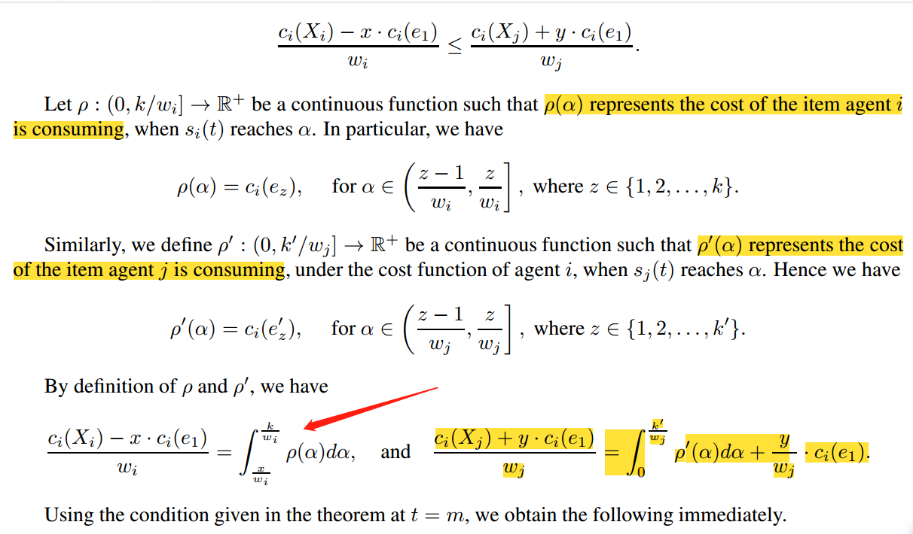
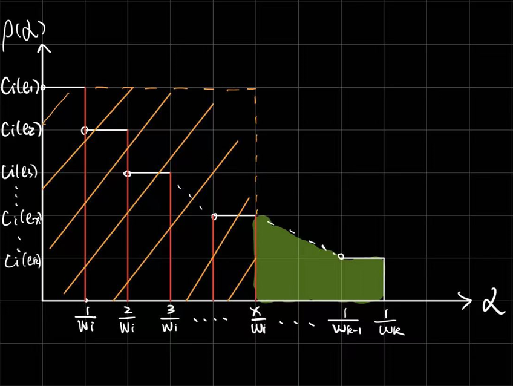

Recently, I have read the 3.2 Analysis of General Picking Sequences

And I feels a little confused about the equtation below:

In my understanding, given the condition 
$$c_i(e_1) \geq c_i(e_2) \cdots c_i(e_x) \cdots \geq c_i(e_k)$$the expression $\rho(\alpha)$ could be shown as follows:

In this figure, I interpret the green area as the integral $\int ^{\frac{k}{w_i}}_{\frac{x}{w_i}} \rho(\alpha) d\alpha$，and the yellow square area as $\frac{x \cdot c_i(e_1)}{w_i}$.Assuming $c_i(X_i) = \sum\limits_{j = 1}^k \frac{c_i(e_j)}{w_i}$, which represents the cumulative sum of all such rectangles, I thus hypothesize that $\frac{c_i(X_i) - x \cdot c_i(e_1)}{w_i} \leq \int ^{\frac{k}{w_i}}_{\frac{x}{w_i}} \rho(\alpha) d\alpha$, and I suspect that the equality in this equation is achieved solely when all $c_i(e)$ are identical.