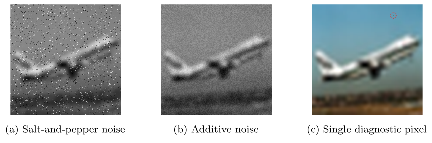
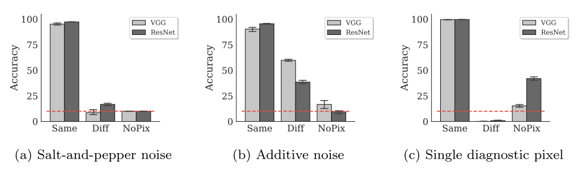
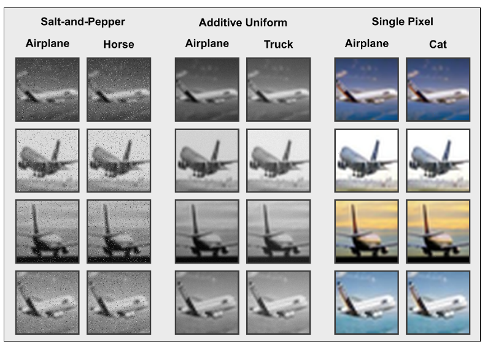
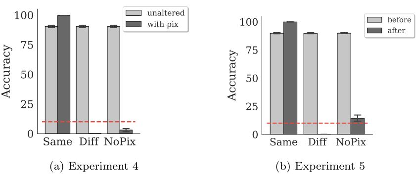
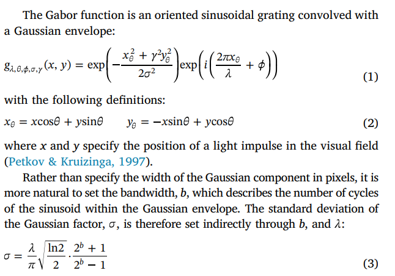
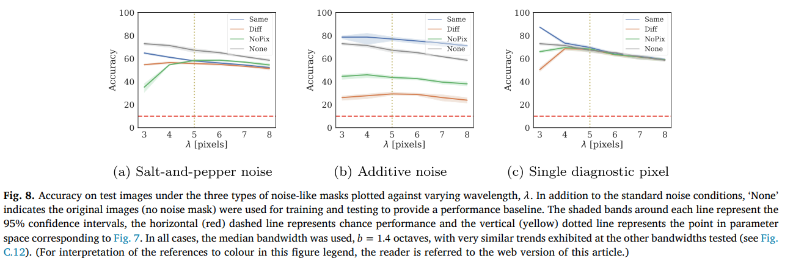

### Instruction

1. CNN model 更倾向于学习 shape，shape-bias
2. 早期的 CNN 所学习到的特征类似于 Gabor filter

### Method
#### 实验1&2&3
1. 使用了三种 noise-like mask 以便数据集中的每个图象不仅包含与形状相关的特征（例如物体轮廓），还包含没有任何形状信息的特征。
- Salt-and-pepper mask 灰度图像 一定的概率 p 对每个 pixel 置为黑/白，这个概率 p 对于每个类别是固定的，但在不同类别之间的范围是[0.03, 0.06]
- Additive Uniform noise 该掩码通过对变换后的灰度图像的每个像素值独立地添加一个从均匀分布中采样的值来创建。这个分布的宽度是[µ-w, µ+w]，其中µ是依赖于图像类别的均值（范围是[-50,50]），2w是所有类别图像的均匀分布宽度，设置为8。
- Single pixel mask 通过在每个224x224图像中替换一个像素来创建。这个像素的位置和颜色与类别相关：像素的位置(x,y)从一个平均值依赖于类别、标准偏差在所有类别中保持恒定的2D高斯分布中采样。类似地，像素颜色的红、绿、蓝值($c_r, c_g, c_b$)也从平均值依赖于类别、方差在所有类别中保持恒定的高斯分布中抽取。如果采样集($x, y, c_r, c_g, c_b$)中的任何值超出其相应的范围，该值将被重新采样。

1. 对一个神经网络模型进行的测试条件。这个模型使用修改后的图像集进行训练，并在三种条件下进行测试。
- "Same" 条件: 测试集的修改方式与训练图像完全相同，即为每个类别生成的掩码使用与训练期间相同的参数。
- "Diff" 条件: 每个类别的噪声掩码参数与另一个类别互换。这里的前提是，如果模型基于形状相关的特征进行决策，那么它将忽略噪声掩码，因此在 "Same" 和 "Diff" 条件下的性能应该相似。另一方面，如果模型依赖于掩码的（非形状）属性，则其在 "Diff" 条件下的性能会比 "Same" 条件下差。
- "NoPix" 条件: 在测试期间完全没有掩码，以估计网络依赖噪声掩码特征的程度。在这种条件下，网络接收没有任何掩码的图像版本，前提是 "Same" 和 "NoPix" 条件下性能的差异应该定量描述网络依赖形状和非形状特征的相对程度。

1. 他们使用了一个16层的VGG网络和一个101层的ResNet网络，这两个网络都是用PyTorch、Keras和TensorFlow的torchvision包提供的。

- 他们进行的模拟有两种类型：一种是在修改后的数据集上从头开始训练网络，另一种是首先在ImageNet上进行预训练，然后在修改后的数据集上进行训练。在进行预训练的网络中，他们替换了VGG/Resnet预训练模型的全连接层，使得最后的全连接层有10个输出单元（对应CIFAR-10的10个类别）。他们报告的结果是针对在ImageNet上进行预训练的网络的。

- 他们尝试了不同的优化算法，包括RMSProp、SGD和Adam。无论使用哪种算法，结果在质量上都保持相同。当从头开始训练网络时，他们使用的学习率为10^−3，当对预训练的网络进行微调时，他们使用的学习率为10^−5（在Gabor滤波器模型中，始终为10^−4）。在所有情况下，他们都使用交叉熵作为损失函数。

- 他们提到，两种类型的网络的输入都是一个3通道的RGB图像。对于灰度图像，所有三个通道的值都被设为相同的值。

4. 关于三个不同的实验，每个实验针对上文描述的一种噪声掩模。结果显示在图3中。在所有三个实验中，作者们观察到，在“Same”（相同）噪声条件下，两个网络能几乎完美地分类图片。

- 在盐和胡椒噪声以及单个像素的实验中，“Diff”（不同）条件下的表现等于或低于随机。值得注意的是，“Diff”条件将各类别之间的掩模交换。因此，低于随机表现意味着网络完全依赖于掩模进行分类预测，系统地预测出一个与CIFAR-10中原始图像类别不同的类别。这些结果通过“NoPix”（无像素）条件得到确认：当掩模信息被移除时，网络难以根据图像中的信息做出预测，表现下降到接近随机水平。

- 对于单个像素实验，ResNet-101在“NoPix”条件下的准确率比VGG-16稍好，这表明在这种情况下，网络可能在使用图像的其他特征，而不仅仅是噪声掩模。然而，即使在这种情况下，与“Same”条件相比，性能也有显著下降。

- 加性噪声实验展示了一个引人入胜的行为：当噪声掩模完全移除（“NoPix”条件）时，模型的表现比图像包含来自不同类别的掩模（“Diff”条件）时更差。换句话说，移除掩模使得图像对模型的信息量减少，这不仅与包含正确类别相关（“Same”）掩模的图像相比，也与包含错误（“Diff”）掩模的图像相比。这表明模型似乎依赖于噪声掩模的存在来进行推断。
  

- 进一步阐述，无论使用哪种类型的正则化（他们尝试了几种知名的正则化方法，包括批量标准化、权重衰减和丢弃），结果的模式都是相同的。这些结果清楚地表明，模型学习依赖于噪声掩模的特征，而不是图像中存在的与形状相关的信息。即使在极端情况下，其中在50176个像素中只有一个像素能够诊断出类别，模型也更喜欢基于这个特征进行分类，而不是图像中存在的其他与形状相关的特征。

- 图4显示了四个以上述方式修改的示例图片，并根据这些图片上的掩模进行了不同的分类。请注意，对于人类来说，区分卷积神经网络用于进行这些图像分类的各种盐和胡椒噪声和均匀噪声掩模是困难的。

图4 包含了四张从CIFAR-10测试集中选取并添加了噪声蒙版的图片。每一张图片都包含了一个不同的噪声蒙版。然而，同一列的所有图片包含的噪声蒙版有着共享的统计特性。 例如，第一列的所有图片包含的是从同一分布中取样的"盐和胡椒"噪声蒙版（详见方法部分），而第二列的图片则从一个不同的分布中取样噪声蒙版。因此，网络将第一列的每一张图片都分类为"飞机"，而将第二列的每一张图片都分类为"马"。类似地，中间的两列图片包含的是从两个不同分布中取样的添加均匀噪声蒙版的图片，而最右边的两列图片包含的是一个单一预测像素（肉眼几乎看不见）。

#### 实验4&5
5. 为什么人类更倾向于依赖于形状相关的特征来分类物体，而标准的卷积神经网络（CNN）则不是这样的可能原因?

- 作者提出，人类在进行新的分类任务时，会受到过去经验的指导。因此，当人类看到带有叠加噪声的物体时，他们依赖于基于形状的信息，而较少注意到非形状相关的特征，比如上述图片中的掩模。

- 作者进行了两个进一步的实验，以测试网络是否也从并发的和过去的经验中进行了类似的泛化。这两个实验都在单像素掩模上进行，因为这似乎是最引人注目的发现，并且我们在这种情况下得到了最清晰的结果模式。

- 在实验4中，作者将训练集分为两个子集。第一个子集（带有像素的子集）包含了CIFAR-10中随机选取的三个类别，并且如上所述，这些类别的所有图像中都包含了与类别相关的像素。第二个子集（未改变的子集）包含了CIFAR-10中剩余的七个类别，这些类别被保留原样，也就是说，我们没有在这个子集的图像中添加与类别相关的像素。

- 我们对所有十个类别同时进行了VGG-16网络的训练。我们感兴趣的是找出网络是否从一个子集泛化到另一个子集，并开始使用用于分类“未改变”子集中图像的特征来分类“带有像素”子集中的图像。实验的所有其他细节与实验1中的一样。

- 在第四个实验中，模型成功地预测了“未改变”子集中的图像，准确率接近90%。然而，“带有像素”的子集的性能完全依赖于添加像素的位置和颜色：当测试图像在同一位置包含像素时，准确率接近100%，但是当这个像素被移除时，准确率下降到低于随机水平。因此，网络似乎并没有将在“未改变”类别中学习到的特征（同时）泛化到包含诊断性像素的类别中。

- 在第五个实验中，我们测试了当网络首先在不包含此类像素的图像上进行训练（“之前”阶段），然后在第二个（“之后”）阶段插入此类像素进行训练时会发生什么。在第一阶段，我们在未改变的CIFAR-10训练集上训练了一个VGG-16网络。一旦网络学习了这个任务，我们在第二阶段训练它处理修改后的图像集，每个类别中都插入了一个预测性的像素。因此，“之前”和“之后”阶段之间改变的只是每张图像中插入了一个与类别相关的像素。

- 模型在经历预测像素插入的阶段后表现出的行为。相反地，模型并没有依赖过去处理这些图像的经验，而是完全依赖于预测像素进行分类。准确率从“之前”阶段的近90%下降到“之后”阶段在“Diff”条件下的0%。关键的是，当预测像素被移除时，模型完全忘记了如何进行分类 - 在“之后”阶段的“NoPix”条件下，准确率接近随机水平。因此，学习关于诊断特征的知识似乎伴随着先前学习的表现的遗忘。这种“灾难性的遗忘”是神经网络中的一个众所周知的问题（McCloskey & Cohen, 1989），与人类如何将知识从一个任务转移到另一个任务形成鲜明对比。有些人提出了神经网络中的灾难性学习的一些最新解决方案，如弹性权重整合（Kirkpatrick et al., 2017），但是否能克服这些问题还有待观察。

#### Experiment6
这段文本主要在探讨一个深度学习实验的结果，尤其关注了图像分类任务中的某个诊断非形状特征（diagnostic non-shape feature）——一个单一的像素点。这个特征在训练图像中的存在是随机的。

他们首先指出，在许多大型数据集（如ImageNet或CIFAR-10）中，这种特殊但可靠的特征（即，单一像素点）到底有多普遍，还不清楚。

因此，他们进行了实验，研究当只有一部分图像包含这种诊断非形状特征时，网络的行为如何变化。

他们发现，即使不是所有图像都包含这个诊断的像素点，网络仍然依赖于这个信息量大的像素点。即使减少了包含该诊断像素的图像的比例，性能仍然增加，但并未达到在未修改的CIFAR-10训练条件下达到的水平。

最后，他们观察到，当只在一部分图像中插入一个诊断像素时，L2正则化会使网络在原始图像上的性能变差。虽然L2正则化应该帮助网络学习更一般的解决方案，但在这种情况下却导致了相反的效果。

简单来说，这段文本在讨论一个实验，该实验探究了深度学习模型在面对包含或不包含某个特定特征的训练数据时，其性能和学习侧重点的变化。

### A biologically plausible feature space

在模拟中如何使用Gabor滤波器?
- 在每次模拟中，VGG-16的第一卷积层被替换为固定的Gabor滤波器组，这些滤波器旨在模拟早期的灵长类视觉皮层，并匹配原始CNN定义的输出通道数量（64）。
- 每个滤波器组有八个方向（θ）、四个相位（φ）、两个长宽比（γ）,而波长λ和带宽b则被系统地变化。相应的值在Table 1中给出。
- 此外，滤波器的内核被设置为31×31像素，选择奇数是为了在每个图像像素上居中内核。作者选择了相当大的Gabor滤波器尺寸（注意，这与空间规模不同）以允许高斯包络在边缘附近衰减到接近零，从而在计算卷积时避免任何截断的影响。滤波器被绘制出来，以直观地确认它们在框架的边界附近大部分已经衰减到零，避免了边界效应（参见附录中的图C.11）。
- 与前面的实验一样，CIFAR-10图像通过添加以下类型的噪声进行操作：Salt and Pepper、Additive或Single pixel，但仍保持其原始大小为32×32像素。所有图像都被转换为灰度并输入到在前面描述的相同的训练和测试条件下修改的网络中。

Result
这段文本描述了一项针对网络依赖于噪声掩模的假设的测试，假设网络依赖于这些图像中包含的高空间频率信息。为此，作者系统地改变了Gabor滤波器的两个关键参数：波长λ和带宽b。正弦分量的波长λ在3.8像素/周期的范围内变化，而高斯分量的带宽b被选定为1.0, 1.4, 1.8八度，这是根据来自猕猴视觉皮层的测量结果（Petkov & Kruizinga, 1997），对于每一组参数的组合，根据Eq. 3自动计算出γ。

对于每个实验条件，进行了五次实现，每次都有不同的随机初始条件。

图7给出了一个示例性的性能柱状图，直接对比早期的结果，这是在λ=5和b = {1, 1.4, 1.8}的情况下。对于每个测试条件，网络性能的趋势都绘制在图8的λ上。对于这个范围，性能被发现对b的变化基本不敏感，但是全趋势包含在附录中（图C.12和C.13）。

从图7中各测试条件的基本平坦的性能概况来看，网络已经不再依赖于噪声样的掩模来正确分类CIFAR-10图像（尽管还有一些对加性噪声的困扰）。在所有情况下，“Diff”条件的性能都大于零，“NoPix”条件的性能都大于概率（10%）。这种趋势也可以看到在带宽的生物学相关范围内变化的情况下持续存在。

图8显示，尽管随着λ的增加（滤波器代表的空间频率信息减少），性能逐渐下降，但噪声样掩模的效果在4或5像素/周期时已被消除（如图8a和c所示的性能曲线收敛），并在参数空间的大范围内保持稳健。加性噪声条件仍然影响网络性能，但影响程度小于那些端到端训练的CNNs，且在所有条件下，性能在参数范围内都远高于概率。

### Discussion & conclusions
- 标准的卷积神经网络（CNNs）在训练时不会显示出对形状的偏好，即使这些形状特征和非形状特征都对对象类别有预测性。换句话说，标准的CNNs并没有内在的形状偏好。相反，这些模型学会了基于与输出类别强相关的非形状特征来分类对象，即使这些特征小到只有一个像素。
- 我们的数据集被设计为包含诊断性的非形状特征，但众所周知，由于构建时的不同条件和动机，流行的数据集包含各种偏差（Torralba & Efros, 2011）。因此，我们设计的这种偏差可能存在于这些数据集中，标准的网络可能在利用这些偏差。这种假设与Jo和Bengio（2017）最近进行的一项研究一致，他们观察到标准的CNNs倾向于学习图像的表面统计属性，而不是高级抽象。实际上，这为证明标准的CNNs在训练ImageNet时，基于纹理而非形状分类图像，提供了更多的证据（Geirhos等人，2018）。
- 这种学习表面统计属性的倾向可能有助于解释CNNs对对抗性攻击的脆弱性。众所周知，CNNs表现出几种特异性行为，如被欺骗图像（Nguyen, Yosinski, & Clune, 2015）困扰，或对颜色（Hosseini, Xiao, Jaiswal, & Poovendran,2017）、噪声（Geirhos等人，2017）甚至图像中的单个像素（Su,Vargas, & Kouichi, 2017）过度敏感。Ilyas等人（2019）最近争论说，许多对抗性攻击可以归因于数据集中存在的“非鲁棒特征” —— 即，这些特征在数据集中预测图像类别，但对图像的微小扰动非常敏感，因此人类无法理解。相反，如形状这样的高级特征对小的形变具有鲁棒性，人类倾向于依赖形状使他们对图像中的小的、高频的变化不那么脆弱。
- 研究者明确指出，他们的研究结果并不是表明CNNs无法依赖形状特征，如果形状特征是唯一或主要的诊断特征，CNNs肯定会学习并依赖这些特征。然而，他们想要测试的假设是，CNNs是否具有固有的形状偏见，即在存在其他诊断特征的情况下，CNNs是否更倾向于依赖形状。他们的研究结果表明，这并非如此。
- 他们还发现，通过Gabor滤波器对图像进行预处理，将其映射到更生物合理的特征空间，可以使CNNs对某些非形状诊断信号的敏感性降低。这并不是说用这种方式预处理图像就能保证CNNs依赖形状进行分类，或者开始表现出形状偏见。如果设计一个具有空间延伸的预测特征，这个特征可以通过Gabor滤波器，那么网络将最终使用这个特征进行分类，而不是依赖物体的形状。他们在这里展示的是，如果用以生物合理的特征空间作为输入的学习代替端到端的学习，那么就可以使网络对一系列特殊的非形状特征更具鲁棒性。他们选择的Gabor滤波器的参数基于神经生理学数据，并发现这些结果不仅适用于特定的参数值，而且适用于整个参数范围。因此，关键的元素似乎并不是学习这些参数的正确值，而是拥有正确形式的滤波器。
- 引入Gabor滤波器会导致模型整体性能的降低。比如，在使用未修改的CIFAR-10数据集时，模型的准确率一般可以达到95%，但在加入Gabor滤波器后，VGG-16模型的准确率可能会降至70%。这个性能下降的部分原因可能是因为丢弃了颜色信息，并且对于波长和带宽的限制（而不是全范围），以进行系统评估。此外，Gabor核自身也会滤除额外的信息来源，即无结构的、空间高频特征，进一步降低性能。
- 从机器学习的角度来看，这种准确率的降低是个问题。然而，从心理学的角度看，这种通过卷积约束得到的性能平均分布，表明现有CNNs的出色性能依赖于提取那些人类忽略或对其不敏感的高频特征。因此，他们认为这种准确率的下降，展示了端到端训练模型所找到的解决方案的脆弱性和生物不合理性，而非将Gabor滤波器作为CNNs前端的不足。
- 此外，他们也探讨了其他可能的方法，比如在保留端到端学习的同时，改变CNN的架构，使其能学习类似Gabor滤波器的特征空间。一些研究已经表明，施加这样的架构约束，如“视网膜瓶颈”，可以导致类似Gabor的接受场的出现。但是，这样的约束能否被用来克服标准CNNs对数据集中非形状特征的脆弱性，还有待进一步研究。
- 最后，他们指出，从生物学角度来看，更合适的问题可能是解释这些滤波器如何应对进化压力而发展，而从工程角度来看，现在的挑战是推进这一新方向，尽可能在保持鲁棒性的同时，缩小性能差距。