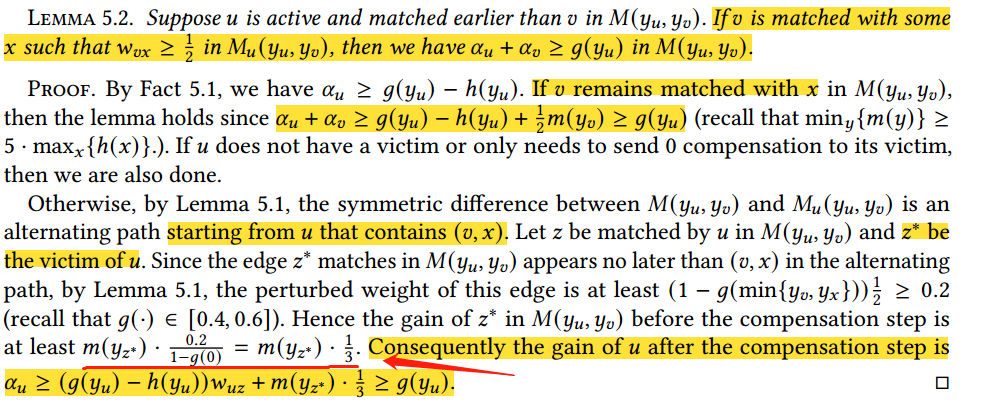
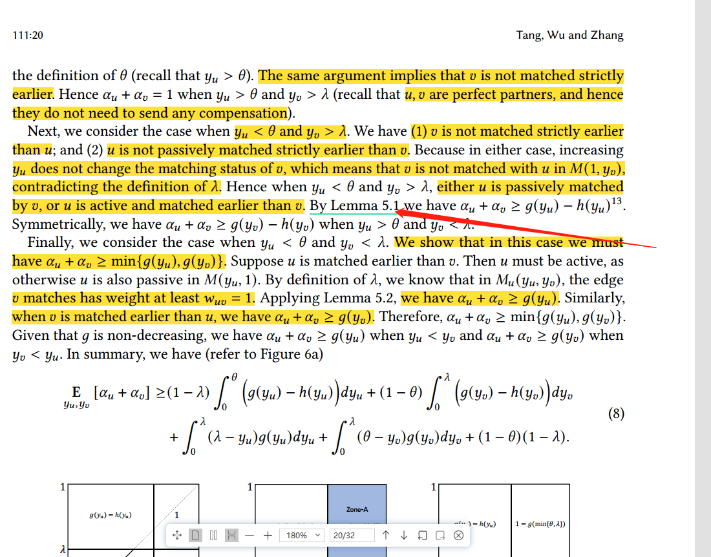
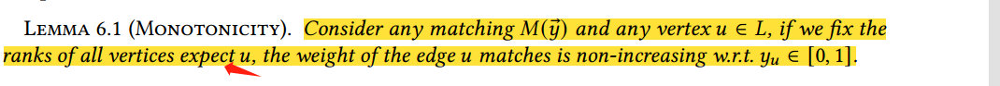

1. Gain of $z^*$: Why the gain of $z^*$ is at least $m \cdot \frac{0.2}{1 - g(0)}$? 
2. Gain of u: After the compensation step, why does the gain of u have a value of $m(y*)$?
3. Ratio Computation: Could you delve deeper into the methodology of computing the ratio? Was this derived analytically or did you use a specific computational tool to arrive at this?

Additionally, while reading, I noticed a couple of potential typos:
- In the section referring to "Fact 5.1", it seems like it should be labeled as "Lemma 5.1".

In another section, I believe the word "expect" might be intended to be "except".

