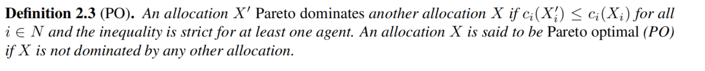
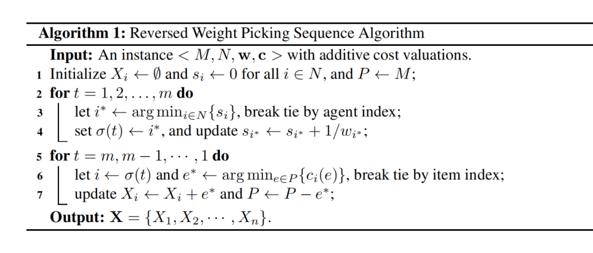
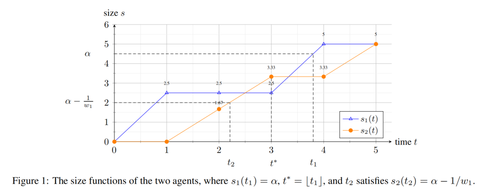
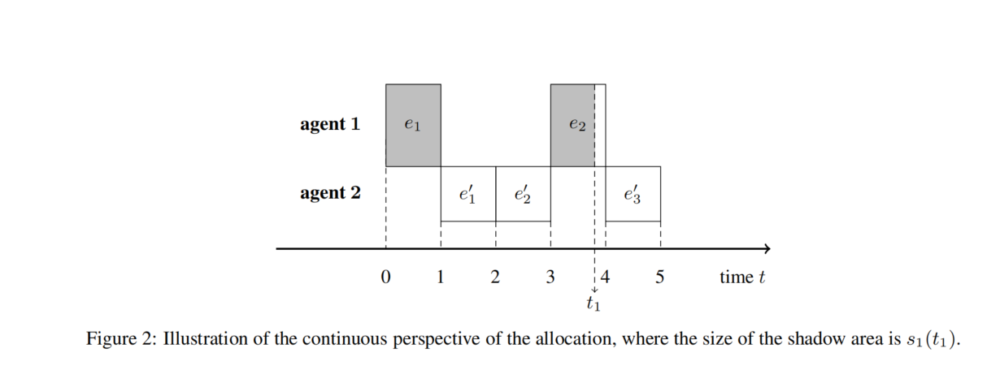

### Weighted EF1 Allocations for Indivisible Chores

#### Question

m个不可分的任务给n个人，每个人都对任务有一个评估函数

定义 $X_i$ 是 $i$ 被分配到的任务, $i \in N$ 

#### Method

两种研究策略
- Allocation of goods  
- Allocation of chores (本文研究)

实际上就是 goods 是好的，人会倾向于去得到，chores 是不好的，人会倾向于避免。

agents 会对 chores 产生负的评估
agents 对每个 chores 产生非负的成本

- envy-freeness(EF): 分配后没有人想和其他人交换 $c_i(X_i) \leq c_i(X_j)$
- proportionality(PROP): 不会拿超过平均值的 $c_i(X_i) \leq \frac{1}{n} \cdot c_i(M)$

上述策略是不可分任务时不成立，例如 2个人 2个任务，显然能构造数据不成立。

- Envy-freeness up to one item（EF1）：envy 会在移除一个envious agent 的 bundle 后消失
- Envy-freeness up to any item (EFX) ：envy 会在从 bundle 里移除任何一个物品后消失
- PROP1
- PROPX

- Whether EFX allocations exist in general remains one of the biggest open problems.

### Result

- Result1: 对于事务分配给带权重倾向的人，存在一种计算WEF1分配的多项式时间算法。
- Result2: 对于将事务分配给带权重倾向的人，存在一个多项式时间算法，用于计算双值实例的WEF1和PO分配。
- Result3: 对于分配给加权代理的杂务，对于三个或三个以上代理，WEF1的价格是无界的, $\frac{4 + \alpha}{4}$ 是两个代理人的上界，$\alpha = \frac{max\{w_1, w_2 \} }{min\{ w_1, w_2\} }$

### 2. Preliminaries
形式上定义：
$m$个不可划分物品集合$M$，$n$个代理人集合为$N$，对于每个代理人都有 $i \in N$, $w_i > 0$, 并且 $\sum_{i \in N} w_i = 1$. 当 $w_i = \frac{1}{n}$, 这个问题称为 unweighted. 定义物品的子集$X \subseteq M$ 称为 bundle. 对于每个代理人还有一个**可累加**的花费函数 $c_i: 2^M \to \mathbb{R}^+ \cup \{0\}$, 给每个bundle 赋值。用 $c_i(e)$ 表示 $c_i(\{e\})$, 意义是第 i 个代理人对第 e 个物品的花费，因此 $c_i(X) = \sum_{e \in X} c_i(e) $, 对于所有 $X \subseteq M $. 不失一般性地，假设现在的花费函数是标准化的，那么 $c_i(M) = 1$. 用 $w = (w_1, \dots, w_n) $ 和 $c = (c_1, \cdots, c_n) $ 分别表示权重函数和花费函数。

为了简单表示，让 $X + e$ 和 $X - e$ 分别代表 $X \cup \{e\}$ 和 $X \\ \{e\}$，对于一个n部分的划分 $X = (X_1, \cdots X_n\} $，其中 $X_i \cap {X_j} = \empty$,且 $\cup _{i \in N} X_i = M$，这里指 代理人$i$ 分配了任务 $X_i\} $. 给一个 $I = $($N$, $M$, **w**, **c**), 我们希望给出一个分配 $X$ 对于所有代理人 $fair$.

思考：w 的意义是想让每个人单独直接有权重，类似于leader权重更高

#### 定义2.1（WEF）
一个分配 $X$ 被称为 $WEF$，当前仅当对任意的 agents $i, j \in N$, 满足
$$\frac{c_i(X_i)}{w_i} \leq \frac{c_i(X_j)}{w_j}$$

如果这里的 $w_i 与 w_j$ 相等，那么问题就被退化成 $EF$. 因此 $WEF$ 不保证存在。

#### 定义2.2 
一个分配 $X$ 被称作是 $WEF1$ 当且仅当对于任意的候选人， $i, j \in N$, 要么 $X_i = \empty$, 要么存在一个物品 $e \in X_i$, 使得
$$
  \frac{c_i(X_i - e)}{w_i} \leq \frac{c_i(X_j)}{w_j}
$$
最终，我们定义PO作为一个分配效率的指标。

#### 定义2.3

### 3. Weighted EF1 for Chores 
#### 3.1 Reversed Weighted Picking Sequence
算法设计: 
- 对于每个 $i$, 维护一个值 $s_i$, 一开始令 $s_i = 0$, 并称 $s_i$ 是候选者$i$的size. 
- 在第一阶段，我们为候选人$\sigma$生成一个长度为$m$的序列：在第$t$轮的时候($t = 1, 2, \cdots, m,$) 我们让 $\sigma (t)$ 作为含有最小 $s_i$ 的候选者，并且令$si = si + 1 / w_i$.
- 在第二阶段，我们让候选者按照 $\sigma(m), \sigma(m - 1), \cdots, \sigma(1)$的顺序取物品。当 $i = \sigma(t)$ 的时候，让候选者选着当前剩余项目中花费最小的那一项。称$\sigma(1), \sigma(2), \cdots, \sigma(m)$为前向序列，$\sigma(m), \sigma(m - 1), \cdots, \sigma(1)$ 为选择序列/反转序列。

#### 连续函数角度分析
首先，$s_i:[0, m] \to [0, m]$ 是一个非降函数, 可以把 $(t - 1, t]$ 过程看做是 $i = \sigma(t)$ 以 1 的速度上升. 因此分配可以抽象化成连续时间上的面积，每个长方形代表一个物品，宽度为1，高度为 $\frac{1}{w_i}$.

显然对于同一个候选人，选择的满足,因为从后往前取，每次取花费最少的，所以有：
$$c_i(e_1) \geq c_i(e_2) \geq \cdots \geq c_i(e_k)$$

对于 $X_i = \{e_1, e_2, \cdots, e_k\}$, $X_j = \{ e'_1, e'_2, \cdots, e'_{k'} \}$下面要证明
$$\frac{c_i(X_i - e_1)}{w_i} \leq \frac{c_i(X_j)}{w_j}$$
现在我们从连续性的角度观察 $\frac{c_i(X_i)}{w_i}$ 的变化情况，重申一下，这里 $s_i$ 代表第 $t$ 时刻的时候，$X_i$ 的 size，并且 $s_i(m) = \frac{k}{m}$. 当 $s_i(t)$ 从 $\frac{z - 1}{w_i}$ 变成 $\frac{z}{w_i}$ 的时候，有 $z \in [k]$, 物品 $e_z$ 被代理人 $i$ 连续地消耗。 不妨令 $\rho : (0, \frac{k}{w_i}] \to \mathbb{R}^+ $ 是一个连续的函数，$\rho(\alpha)$ 代表地 $i$ 个人当 $s_i(t)$ 到达 $\alpha$ 时的花费, 特别的有：
$$\rho(\alpha) = c_i(e_z), for \ \alpha \in (\frac{z - 1}{w_i}, \frac{z}{w_i}]), where \ z \in {1, 2, \cdots, k}$$
通过定义，$\rho$ 时一个非增的函数.
类似的可以定义，$\rho'(\alpha)$ 代表地 $j$ 个人当 $s_j(t)$ 到达 $\alpha$ 时在 $c_i$ 下的花费, 特别的有：
$$\rho'(\alpha) = c_i(e_z'), for \ \alpha \in (\frac{z - 1}{w_j}, \frac{z}{w_j}]), where \ z \in {1, 2, \cdots, k'}$$
通过定义，$\rho$ 时一个非增的函数.

通过定义的值
$$\frac{c_i(X_i - e_1)}{w_i} = \int _{\frac{1}{w_i}}^{\frac{k}{w_i}} \rho (\alpha) d\alpha, \ and \ \  \frac{c_i(X_j)}{w_j} = \int_0^{\frac{k'}{w_j}} \rho'(\alpha)d\alpha$$

接下来通过有一些有效的引理证明